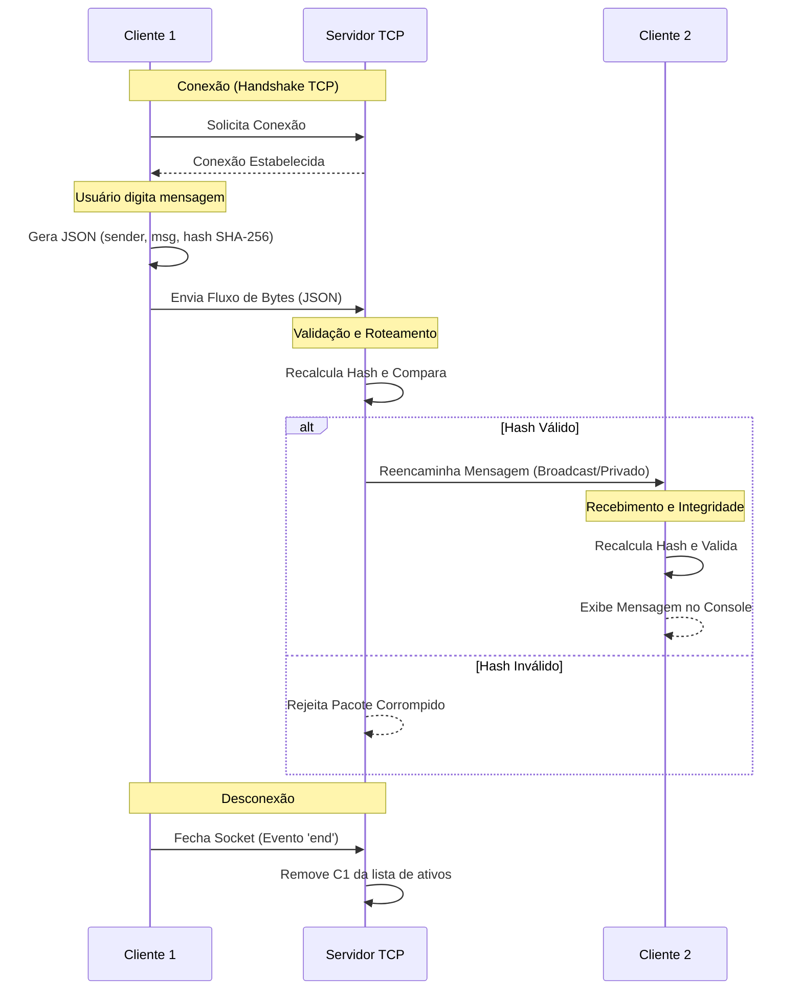

# Relatório de Laboratório

> Link para o gitlab: [https://gitlab.com/jala-university1/cohort-4/PT.CO.CSNT-245.GA.T1.26.M2/SB/gustavo-henrique-de-jesus-da-silva/lab-week-3](https://gitlab.com/jala-university1/cohort-4/PT.CO.CSNT-245.GA.T1.26.M2/SB/gustavo-henrique-de-jesus-da-silva/lab-week-3)

## Passo 1 – Design da Arquitetura

O sistema segue uma arquitetura clássica **Cliente-Servidor Centralizada**.

### Papéis
- **Servidor TCP:** Atua como a autoridade central e roteador de mensagens. Ele mantém uma lista ativa de sockets conectados e é responsável por retransmitir os dados entre os usuários.
- **Clientes TCP:** Funcionam como terminais para o usuário final. Eles iniciam as conexões, enviam os pacotes serializados e exibem os dados recebidos do servidor.

### Fluxo de Comunicação
1.  **Conexão:** O cliente estabel´ece um aperto de mão (handshake) com o servidor usando o endereço IP e uma porta TCP específica.
2.  **Envio de Mensagens:** Uma vez conectado, o cliente envolve a entrada do usuário em uma estrutura JSON, calcula um hash de segurança e o envia como um fluxo de bytes.
3.  **Recebimento de Mensagens:** O servidor analisa o fluxo, valida o remetente e decide o roteamento (Broadcast para todos ou Privado para um usuário específico).
4.  **Desconexão:** Quando um cliente fecha a aplicação, o servidor detecta o término do socket e remove o usuário do registro ativo para liberar recursos.

## Passo 2 – Implementação do Servidor

O servidor foi projetado para lidar com alta concorrência e roteamento confiável de mensagens.

-   **Modelo de Concorrência:** Aproveitando a **E/S Assíncrona e o Event Loop** do Node.js, o servidor gerencia múltiplas conexões de clientes simultaneamente sem a necessidade de gerenciamento manual de threads (Hilos). Cada nova conexão é tratada como um evento, permitindo que o servidor permaneça responsivo.
-   **Serialização:** Os dados são transmitidos usando **JSON (JavaScript Object Notation)**. Isso garante que objetos complexos (contendo remetente, destinatário, mensagem e hash) possam ser facilmente convertidos em uma string e depois de volta em um objeto na recepção.
-   **Roteamento de Mensagens:**
    -   **Broadcast:** Por padrão, as mensagens são repetidas através de todos os sockets ativos, permitindo um ambiente de chat público.
    -   **Mensagem Privada:** O servidor verifica o campo `receiver` no pacote JSON. Se um nome de usuário específico for o alvo, o servidor procura o socket desse usuário em um `Map` e envia os dados apenas para ele.

## Passo 3 – Implementação do Cliente

O cliente serve como a interface do usuário para a comunicação em rede.

-   **Gerenciamento de Conexão:** O cliente utiliza o módulo `net` para se conectar ao host e porta do servidor. Ele lida com timeouts de conexão e procedimentos iniciais de handshake.
-   **Interação pelo Console:** Usando a interface `readline`, o cliente captura a entrada do usuário em tempo real. Ele suporta sintaxes especiais (como `@usuario`) para distinguir entre mensagens públicas e privadas.
-   **Identificação do Emissor:** Cada pacote enviado anexa automaticamente o apelido escolhido pelo usuário, permitindo que o receptor identifique quem enviou a mensagem, mesmo em um broadcast lotado.

## Passo 4 – Integridade e Tratamento de Erros

Para garantir que o sistema seja confiável e seguro, várias camadas de proteção foram implementadas.

-   **Integridade de Dados (SHA-256):** Antes de enviar qualquer mensagem, o cliente gera um **hash SHA-256** do conteúdo da mensagem. Ao receber, o servidor (e o cliente de destino) recalcula esse hash. Se os hashes não coincidirem, isso indica que a mensagem foi corrompida ou alterada durante o trânsito, e o sistema a rejeita.
-   **Tratamento de Exceções:**
    -   **Quedas de Conexão:** O sistema monitora os eventos `close` e `end` para evitar que o servidor trave quando um cliente sai abruptamente.
    -   **Erros de Transmissão:** Blocos try-catch são usados durante a análise do JSON para lidar com fluxos de dados malformados que podem ocorrer devido a ruídos na rede.

## Passo 5 – Conteinerização

-   **Construção (Build):** Um `Dockerfile` define o ambiente de execução (Node.js), instala as dependências e define o ponto de entrada para a aplicação.
-   **Simulação de Rede:** Usando o **Docker Compose**, podemos criar uma rede virtual onde múltiplos containers de clientes e um container de servidor interagem. Isso nos permite simular uma infraestrutura distribuída em uma única máquina física, testando como o sistema se comporta sob condições de rede simuladas.

## Perguntas de Reflexão do Laboratório

### 1. Quais diferenças fundamentais existem entre comunicação síncrona e assíncrona em sistemas distribuídos?
A comunicação síncrona exige que o emissor espere por uma resposta antes de prosseguir (bloqueante), o que pode causar gargalos. A comunicação assíncrona permite que o emissor continue sua execução imediatamente após enviar a mensagem (não-bloqueante), tornando-a muito mais eficiente para sistemas em tempo real, como aplicações de chat.

### 2. Por que o modelo Publish–Subscribe é mais escalável que o modelo Cliente–Servidor?
No Cliente-Servidor, o servidor tem um relacionamento direto e individual com cada cliente, o que se torna um gargalo à medida que o número de usuários cresce. O modelo Publish-Subscribe usa um intermediário ("Broker") para desacoplar as entidades; os publicadores não precisam saber quem são os assinantes, permitindo que o sistema escale horizontalmente adicionando mais brokers ou assinantes sem afetar os publicadores.

### 3. Em quais cenários reais você utilizaria sockets TCP em vez de um sistema baseado em eventos?
Sockets TCP são ideais para cenários que exigem fluxos de dados **persistentes, de baixa latência e bidirecionais** com entrega garantida. Exemplos incluem jogos online, acesso a terminais remotos (SSH), plataformas de negociação financeira e streaming em tempo real onde a ordem dos pacotes é crítica.

### 4. Como o desacoplamento impacta a manutenibilidade de sistemas de rede?
O desacoplamento permite que componentes individuais sejam atualizados, substituídos ou escalados sem afetar o restante do sistema. Por exemplo, você pode alterar o algoritmo de hash ou o formato de serialização no servidor sem precisar reescrever toda a lógica do cliente, desde que a interface permaneça consistente.

### 5. Quais vantagens o Docker oferece para simular infraestruturas reais de rede?
O Docker fornece um ambiente consistente que imita as configurações de produção. Ele permite que os desenvolvedores simulem topologias de rede complexas (sub-redes, gateways) e restrições de recursos (limites de CPU/RAM) em uma máquina local, garantindo que o que funciona na máquina do desenvolvedor também funcione na nuvem.
