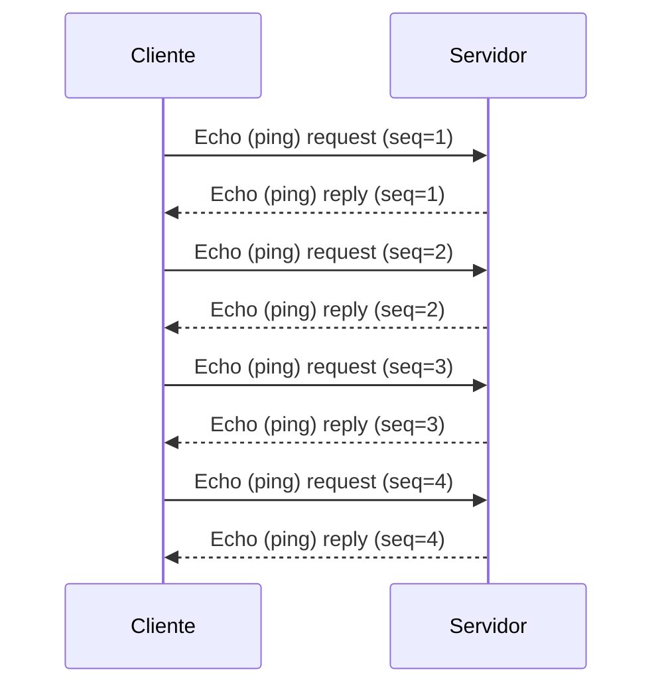
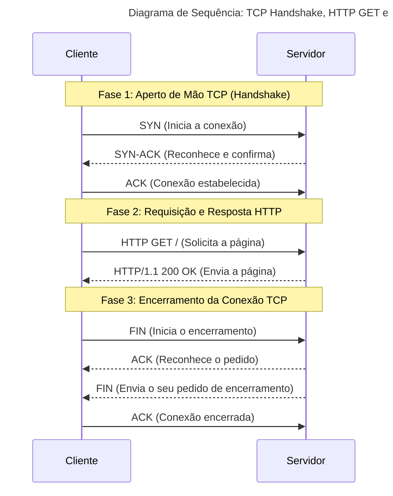

# Atividade #3.1 - Análise de Tráfego de Rede

**Objetivo:**

Documentar a análise do tráfego de rede e a troca de mensagens com os protocolos DHCP, ICMP, DNS, HTTP e TCP, utilizando
o Kali Linux como ambiente de teste.

---

## A. Preparação do Ambiente de Teste

Nesta fase, preparei meu ambiente de teste para a captura e análise dos pacotes de rede, seguindo os passos abaixo.

### Passo 1: Configuração da Máquina Virtual

No meu software de virtualização (VirtualBox), fiz às configurações de rede da VM Kali Linux e alterei o modo de anexo
para **Bridge Adapter** (Modo Bridge). Esta configuração é crucial para que a VM receba um endereço IP diretamente do
roteador da minha rede local.


### Passo 2: Iniciação do Wireshark

Com a VM configurada, abri um terminal no Kali Linux e executei o comando `sudo wireshark &` para iniciar o Wireshark
com privilégios de administrador. Na tela inicial, selecionei a interface de rede ativa (`eth0`) para iniciar a captura
do tráfego.


---

## B. Execução dos Testes e Análises

Com o Wireshark capturando, realizei os testes para cada protocolo.

### 1. Análise DHCP (Dynamic Host Configuration Protocol)

O **DHCP (Dynamic Host Configuration Protocol)** é um protocolo de rede que permite aos dispositivos em uma rede obterem automaticamente configurações de rede, como endereços IP, máscaras de sub-rede, gateways padrão e servidores DNS. Isso simplifica a administração da rede, eliminando a necessidade de configurar manualmente cada dispositivo.

Para capturar o processo de atribuição de IP, forcei a renovação do endereço da minha VM.

**Procedimento:**

Em sistemas Kali Linux modernos, o `dhclient` pode não estar instalado por padrão, pois a rede é gerenciada pelo `NetworkManager`. O procedimento correto para forçar a renovação de um IP é usar o utilitário de linha de comando `nmcli`.

1.  Primeiro, execute `nmcli connection show` para encontrar o nome da sua conexão de rede (geralmente `Wired connection 1` para uma conexão a cabo).

    ```bash
    nmcli connection show
    ```


2.  Em seguida, use o nome da conexão para reiniciá-la. Isso força o processo DHCP (liberar e renovar). Substitua `"Wired connection 1"` pelo nome da sua conexão, se for diferente.

    ```bash
    sudo nmcli connection down "Wired connection 1" && sudo nmcli connection up "Wired connection 1"
    ```


No Wireshark, parei a captura e apliquei o filtro `bootp`. O resultado, como visto na imagem abaixo, mostra os quatro passos do processo **DORA (Discover, Offer, Request, Acknowledge)**. Este é o ciclo fundamental pelo qual um cliente DHCP obtém um endereço IP de um servidor DHCP.


**Análise dos Pacotes DHCP:**

A seguir, detalhamos as informações encontradas em cada pacote da comunicação DHCP.

- **Endereço IP inicial do cliente:** `0.0.0.0`. O cliente usa este endereço para se anunciar na rede, pois ainda não possui um IP válido.
  *Onde encontrar: No pacote `Discover`, campo "Client IP address".*
  

- **Endereço IP de destino (Broadcast):** `255.255.255.255`. As mensagens iniciais são enviadas em broadcast para que todos na rede, incluindo o servidor DHCP, possam recebê-las.
  *Onde encontrar: No pacote `Discover`, campo "Destination".*
  

- **Endereço MAC de destino (Broadcast):** `ff:ff:ff:ff:ff:ff`. Este é o endereço de broadcast da camada física, garantindo que o quadro seja entregue a todos os dispositivos no segmento de rede.
  *Onde encontrar: No pacote `Discover`, na seção "Ethernet II", campo "Destination".*
  

- **Endereço IP de destino do servidor:** `255.255.255.255`. O servidor também responde em broadcast no pacote `Offer`, pois o cliente ainda não tem um IP configurado para receber uma mensagem direta.
  *Onde encontrar: No pacote `Offer`, campo "Destination".*
  

- **Endereço MAC de destino do servidor:** `08:00:27:9b:82:a3`. Embora o IP de destino seja broadcast, o quadro Ethernet é direcionado ao endereço MAC específico do cliente que fez a solicitação.
  *Onde encontrar: No pacote `Offer`, na seção "Ethernet II", campo "Destination".*
  

- **Endereço IP proposto ao cliente:** O IP que o servidor está oferecendo ao cliente.
  *Onde encontrar: No pacote `Offer`, campo "Your (client) IP address".*
  

- **Endereço IP selecionado pelo cliente:** `192.168.1.104`. No pacote `Request`, o cliente confirma qual endereço IP ele está aceitando ou renovando.
  *Onde encontrar: No pacote `Request`, na opção "Requested IP Address".*
  

- **Confirmação final (IP e Tempo de Alocação):** IP: `192.168.1.104`, Tempo: `86400 segundos (24 horas)`. O pacote `ACK` é a fonte final da verdade, confirmando o endereço IP atribuído e por quanto tempo ele é válido.
  *Onde encontrar: No pacote `ACK`, campo "Your (client) IP address" e na opção "Lease Time".*
  

### 2. Análise ICMP (Internet Control Message Protocol)

O **ICMP (Internet Control Message Protocol)** é um protocolo da camada de rede usado para enviar mensagens de erro e informações operacionais indicando, por exemplo, se um serviço solicitado não está disponível ou se um host ou roteador não pode ser alcançado. A ferramenta `ping` é um dos usos mais comuns do ICMP, permitindo testar a conectividade entre dois hosts.

Para analisar o ICMP, utilizei o comando `ping` para testar a conectividade com `debian.org`.

**Procedimento:**

1. Iniciei uma nova captura e executei `ping -c 4 debian.org` no terminal.


2. Parei a captura e apliquei o filtro `icmpv6`. A imagem abaixo mostra os pacotes de `Echo (ping) request` e
   `Echo (ping) reply`.


**Diagrama de Sequência da Troca de Mensagens ICMP:**

A seguir, é apresentado um diagrama que ilustra a troca de mensagens ICMP (ping e pong) entre o cliente e o servidor, com base na captura de pacotes realizada.



Neste diagrama:

- O **Cliente** (com o endereço IPv6 `2804:868:d060:6ec2:...`) inicia a comunicação enviando uma solicitação `Echo (ping) request`.
- O **Servidor** (`debian.org`, com o endereço IPv6 `2a04:4e42:600::644`) responde a cada solicitação com uma `Echo (ping) reply`.
- A troca de mensagens é sequencial, indicada pelo `seq`, garantindo que cada resposta corresponda à sua solicitação.

### 3. Análise DNS (Domain Name System)

O **DNS (Domain Name System)** é um sistema hierárquico e distribuído que traduz nomes de domínio legíveis por humanos (como `debian.org`) em endereços IP numéricos (como `151.101.66.132`), que são usados pelos computadores para se comunicarem. É essencial para a navegação na internet.

Para que o `ping` funcionasse, meu sistema primeiro precisou resolver o nome `debian.org` para um endereço IP.

**Procedimento:**

1. Na mesma captura do `ping`, alterei o filtro para `dns`. A captura resultante, mostrada abaixo, exibe a consulta DNS (`Standard query`) e sua respectiva resposta (`Standard query response`).


**Análise do Pacote DNS:**

- **Porta do servidor DNS:** `53`. Esta é a porta padrão para serviços DNS.
  *Onde encontrar: No pacote "Standard query", na seção "User Datagram Protocol", campo "Destination Port".*
  

- **Endereço IP do servidor DNS:** `201.77.112.48`. Este é o endereço do servidor para o qual a consulta DNS foi enviada.
  *Onde encontrar: No pacote "Standard query", na seção "Internet Protocol Version 4", campo "Destination".*
  

- **Endereço IP retornado para `debian.org`:** `151.101.[2,66,130,194].132`. A resposta do servidor DNS contém o(s) endereço(s) IP correspondente(s) ao nome de domínio solicitado.
  *Onde encontrar: No pacote "Standard query response", na seção "Answers".*
  

### 4. Análise HTTP e TCP

O **HTTP (Hypertext Transfer Protocol)** é o protocolo fundamental para a comunicação de dados na World Wide Web, usado para carregar páginas web. O **TCP (Transmission Control Protocol)** é um protocolo da camada de transporte que fornece comunicação confiável, ordenada e com verificação de erros entre aplicações em redes IP. Ele garante que os dados cheguem ao destino sem perdas e na ordem correta.

Finalmente, analisei o processo de carregamento de uma página web.

**Procedimento:**

1. Iniciei uma nova captura e acessei `http://debian.org` no navegador.


2. Parei a captura e apliquei o filtro `tcp or http`. A imagem abaixo destaca as fases da comunicação: o Handshake TCP,
   a requisição HTTP GET e o encerramento da conexão.


**Diagrama de Sequência de Mensagens (MSC):**

Com base na análise da captura, o diagrama de sequência de mensagens (MSC) foi elaborado para ilustrar o **aperto de mão TCP (TCP 3-way Handshake)**, que é o processo de três etapas usado para estabelecer uma conexão TCP. Ele garante que ambos os lados da comunicação estejam prontos para enviar e receber dados. Em seguida, mostra a requisição HTTP e o encerramento da conexão.


