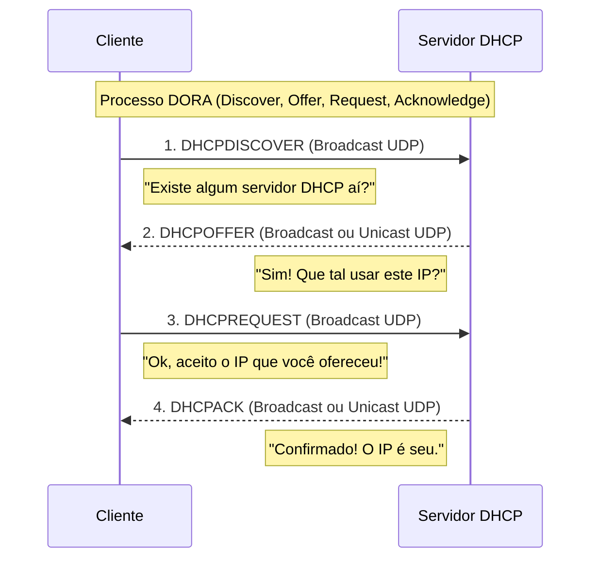
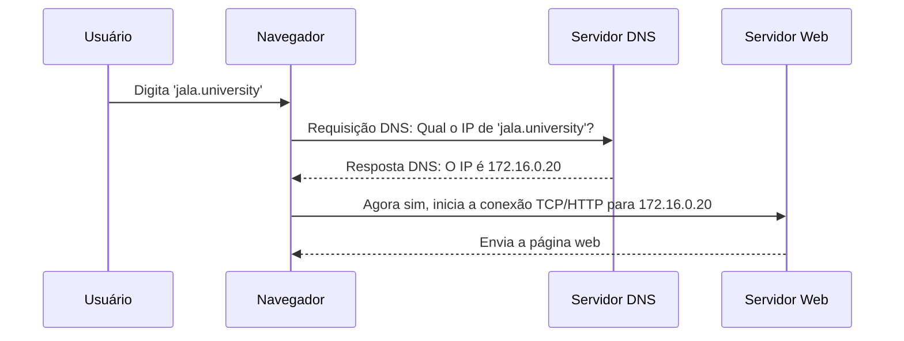
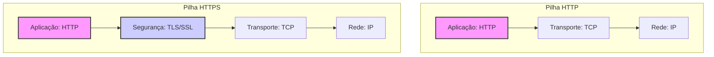
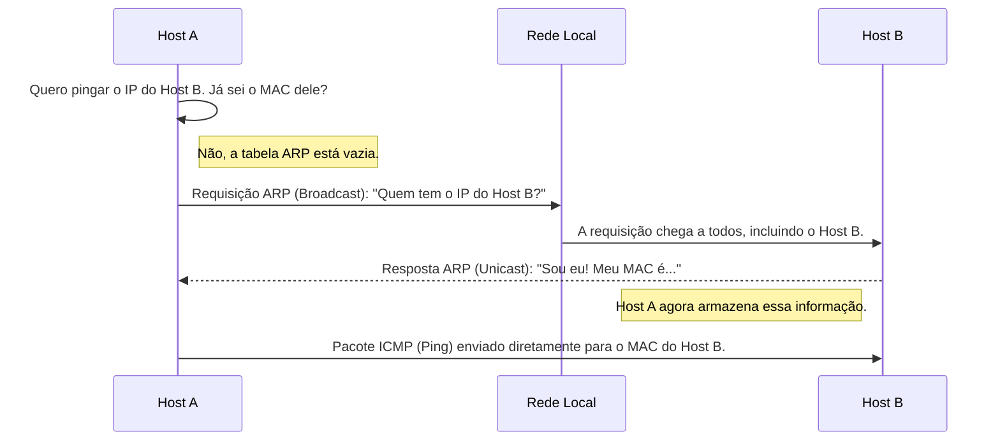
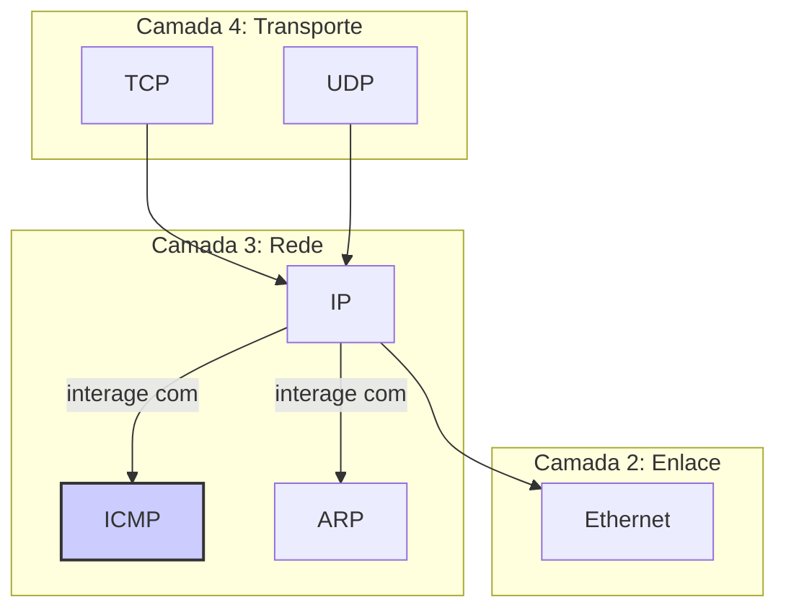
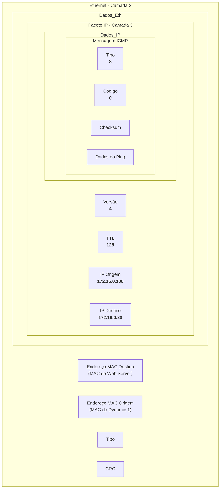

# Atividade #3.2: Emulação de Rede com Cisco Packet Tracer

**Objetivo:**

Construir uma rede LAN no Cisco Packet Tracer para emular e analisar o comportamento dos componentes de rede e dos protocolos de comunicação envolvidos.


## A. Preparação do Ambiente de Teste

Siga os passos abaixo para montar e configurar toda a infraestrutura da rede no Packet Tracer.

### Passo 1: Construir a Topologia de Rede

1.  Adicionei os seguintes dispositivos ao seu espaço de trabalho. Os encontrei nas categorias no canto inferior esquerdo:
    - **Switches:** Na categoria `Network Devices` -> `Switches`, adicione 2 switches do modelo **`2960`**.
    - **Servidores:** Na categoria `End Devices`, adicione 5 servidores genéricos (**`Server-PT`**).
    - **PCs:** Na categoria `End Devices`, adicione 3 computadores genéricos (**`PC-PT`**).
2.  Posicione os dispositivos de forma organizada para replicar a topologia da imagem de referência.


### Passo 2: Configurar os Servidores

Para cada servidor, clique no dispositivo para abrir sua janela de configuração e siga as instruções.

#### 1. Configurando o Servidor DHCP

1.  **Renomeie o servidor:** Na aba **Config**, altere o **Display Name** para `DHCP Server`.


2.  **Defina o Gateway:** Em **GLOBAL -> Settings**, configure o **Default Gateway** como `172.16.0.1`.


3.  **Configure o IP:** Em **INTERFACE -> FastEthernet0**, defina:
    - **IP Address:** `172.16.0.10`
    - **Subnet Mask:** `255.255.0.0`


4.  **Configure o Serviço DHCP:** Vá para a aba **Services -> DHCP**.
    - Habilite o serviço (**Service On**).
    - Configure o Pool com os seguintes valores:
        - **Default Gateway:** `172.16.0.1`
        - **DNS Server:** `172.16.0.11`
        - **Start IP Address:** `172.16.0.100`
    - Clique em **Save**.


5.  **Desabilite outros serviços:** Certifique-se de que todos os outros serviços (HTTP, DNS, etc.) estejam desligados (**Off**).


#### 2. Configurando o Servidor DNS

1.  **Renomeie o servidor:** Para `DNS Server`.
2.  **Defina o Gateway:** `172.16.0.1`.


3.  **Configure o IP:**
    - **IP Address:** `172.16.0.11`
    - **Subnet Mask:** `255.255.0.0`


4.  **Configure o Serviço DNS:** Vá para a aba **Services -> DNS**.
    - Habilite o serviço (**Service On**).
        - Adicione os seguintes registros do tipo "A Record":
        - **Name:** `jala.university`, **Address:** `172.16.0.20` (Clique em **Add**)
        - **Name:** `www.teste.com`, **Address:** `172.16.0.30` (Clique em **Add**)
        - **Name:** `mail.jala.university`, **Address:** `172.16.0.40` (Clique em **Add**)


5.  **Desabilite outros serviços.**


#### 3. Configurando o Servidor Web (Jala University)

1.  **Renomeie o servidor:** Para `Web Server: jala.university`.
2.  **Defina o Gateway:** `172.16.0.1`.


3.  **Configure o IP:**
    - **IP Address:** `172.16.0.20`
    - **Subnet Mask:** `255.255.0.0`


**Configure o Serviço HTTP:** Vá para a aba **Services -> HTTP**.
* Certifique-se de que **HTTP** e **HTTPS** estão **On**.
* Clique em `index.html` e depois em **Edit**.


* Substitua o conteúdo pelo seguinte: `<h1>Bem vindo à página web de JALA University!</h1>`


* Clique em **Save**.


5.  **Desabilite outros serviços.**


#### 4. Configurando o Servidor Web (Teste)

1.  **Renomeie o servidor:** Para `Web Server: www.teste.com`.
2.  **Defina o Gateway:** `172.16.0.1`.


3.  **Configure o IP:**
    - **IP Address:** `172.16.0.30`
    - **Subnet Mask:** `255.255.0.0`


4.  **Configure o Serviço HTTP:** Vá para **Services -> HTTP**.
    - Edite o `index.html` e substitua o conteúdo por: `<h1>Esta é uma página de teste!</h1>`
    - Salve a alteração.


5.  **Desabilite outros serviços.**


#### 5. Configurando o Servidor de E-mail

1.  **Renomeie o servidor:** Para `Email Server: mail.jala.university`.
2.  **Defina o Gateway:** `172.16.0.1`.


3.  **Configure o IP:**
    - **IP Address:** `172.16.0.40`
    - **Subnet Mask:** `255.255.0.0`


4.  **Configure o Serviço de E-mail:** Vá para **Services -> EMAIL**.
    - Certifique-se de que **SMTP** e **POP3** estão **On**.
    - Em **Domain Name**, digite `jala.net` e clique em **Set**.
    - Crie as contas de usuário:
        - **User:** `user1`, **Password:** `datacom1` (Clique em **+**)
        - **User:** `user2`, **Password:** `datacom2` (Clique em **+**)
        - Adicione sua conta pessoal da mesma forma.


5.  **Desabilite outros serviços.**


### Passo 3: Configurar os Clientes (PCs)

#### 1. PCs Dinâmicos (PC1 e PC2)

1.  Renomeie os PCs para `Dynamic 1` e `Dynamic 2`.
2.  Para cada um, vá para a aba **Desktop -> IP Configuration**.
3.  Selecione a opção **DHCP**. O PC deve receber um endereço IP automaticamente.


#### 2. PC Estático (PC3)

1.  Renomeie o PC para `Static`.
2.  Vá para **Desktop -> IP Configuration**.
3.  Selecione **Static** e preencha:
- **IP Address:** `172.16.0.90`
- **Default Gateway:** `172.16.0.1`
    - **Subnet Mask:** `255.255.0.0`
    - **DNS Server:** `172.16.0.11`


#### 3. Clientes de E-mail (Todos os PCs)

1.  Em cada PC, vá para **Desktop -> Email**.
2.  Configure a conta de e-mail correspondente. Exemplo para `user1` no PC1:
    - **Your Name:** `User 1`
    - **Email Address:** `user1@jala.met`
    - **Incoming Mail Server (POP3):** `mail.jala.met`
    - **Outgoing Mail Server (SMTP):** `mail.jala.met`
    - **User Name:** `user1`
    - **Password:** `datacom1`
3.  Clique em **Save**. Repita para os outros PCs com suas respectivas contas.


## B. Execução dos Testes

### 1. Testes em Modo Tempo Real

Execute os testes abaixo e documente os resultados com capturas de tela.

- **Teste de PING (ICMP):** Abra o **Command Prompt** em um PC e pingue outros dispositivos. Ex: `ping 172.16.0.20`.


- **Teste de Navegador Web (HTTP):** Abra o **Web Browser** em um PC e acesse `http://jala.university`.


- **Teste de E-mail (SMTP/POP3):** Abra o cliente de **Email**, escreva e envie uma mensagem para outro usuário.


### 2. Testes em Modo de Simulação

Troque para o modo **Simulation**, abra o painel de simulação e edite os filtros para exibir apenas: **DHCP, ICMP, HTTP, DNS, SMTP**.

- **Cenário PING:** Execute um `ping` e observe a viagem dos pacotes ICMP.


- **Cenário Web:** Acesse uma URL e observe os pacotes DNS e HTTP.


- **Cenário DHCP:** Em um PC dinâmico, vá para **Command Prompt** e execute `ipconfig /renew`.


- **Cenário E-mail:** Envie um e-mail e observe os pacotes SMTP.


---

## C. Questionário de Análise

Com base nos testes, responda às seguintes perguntas.

### 1. O DHCP é um serviço orientado a conexão?

Não, o DHCP (Dynamic Host Configuration Protocol) é um serviço **não orientado a conexão**.


Um serviço "orientado a conexão" (como o TCP) estabelece uma sessão formal e confiável entre cliente e servidor antes de trocar dados, garantindo que todos os pacotes cheguem em ordem. O DHCP não precisa dessa formalidade. Sua função é atribuir configurações de rede de forma rápida e eficiente. Ele opera usando o protocolo UDP, que é "não orientado a conexão". Isso significa que o cliente simplesmente envia uma mensagem de requisição para a rede e espera que um servidor responda. Não há um "aperto de mão" (handshake) para iniciar a comunicação. Se uma mensagem se perde, o cliente simplesmente a envia novamente após um tempo.

### 2. DHCP utiliza TCP ou UDP?

O DHCP utiliza **UDP** (User Datagram Protocol).


A escolha pelo UDP é fundamental para o funcionamento do DHCP por duas razões principais:

1.  **Necessidade de Broadcast:** Quando um dispositivo cliente se conecta à rede pela primeira vez, ele não possui um endereço IP. Para encontrar um servidor DHCP, ele precisa enviar uma mensagem de *broadcast* (um "grito" para todos na rede local). O UDP suporta mensagens de broadcast de forma nativa, enquanto o TCP é projetado para comunicação ponto a ponto (unicast) e requer um endereço IP de destino específico, algo que o cliente ainda não tem.
2.  **Eficiência e Velocidade:** O processo de obter um IP precisa ser o mais rápido possível para que o dispositivo possa começar a usar a rede. O UDP tem uma sobrecarga (overhead) muito menor que o TCP, pois não gerencia números de sequência, confirmações ou estado de conexão. Isso o torna mais leve e rápido para as transações simples de requisição-resposta do DHCP.

O processo de comunicação DHCP, conhecido como **DORA** (Discover, Offer, Request, Acknowledge), ilustra bem o uso do UDP:



### 3. Qual é a porta usada pelos servidores DHCP?

Servidores DHCP utilizam a porta **67 (UDP)** para escutar as requisições dos clientes.


O serviço DHCP opera com um par de portas UDP bem definido:
*   **Porta 67 (bootps):** É a porta de destino no servidor. O servidor DHCP está sempre "escutando" nesta porta por mensagens de clientes.
*   **Porta 68 (bootpc):** É a porta de origem no cliente. O cliente envia suas requisições a partir desta porta e espera respostas nela.

Essa separação garante que um dispositivo que atua como servidor DHCP em uma rede possa, se necessário, atuar como cliente em outra, sem conflitos de porta.

### 4. Mencione 3 protocolos que usam o serviço TCP.

1.  **HTTP/HTTPS** (Hypertext Transfer Protocol/Secure)
2.  **SMTP** (Simple Mail Transfer Protocol)
3.  **FTP** (File Transfer Protocol)


O TCP (Transmission Control Protocol) é a escolha para aplicações que não podem tolerar perda ou desordem de dados. Ele estabelece uma conexão confiável e garante que todos os pacotes sejam recebidos na ordem correta, solicitando a retransmissão de pacotes perdidos.
*   **HTTP/HTTPS:** Ao carregar uma página web, é crucial que o código HTML, CSS e as imagens cheguem completos e em ordem para que a página seja renderizada corretamente.
*   **SMTP:** Ao enviar um e-mail, a confiabilidade do TCP garante que o conteúdo da mensagem chegue intacto ao destinatário.
*   **FTP:** Ao transferir um arquivo, o TCP assegura que a cópia no destino seja idêntica à original, sem corrupção de dados.

### 5. Qual protocolo intervém antes do HTTP/HTTPS?

O protocolo **DNS** (Domain Name System).


Computadores na internet se comunicam por meio de endereços IP (ex: `172.16.0.20`), que são difíceis para humanos memorizarem. Usamos nomes de domínio mais amigáveis (ex: `jala.university`). O DNS atua como a "lista telefônica" da internet, traduzindo esses nomes em endereços IP.

Antes que seu navegador possa sequer iniciar uma comunicação HTTP para buscar uma página, ele precisa do endereço IP do servidor. O processo é o seguinte:



### 6. Qual é a porta de origem dos servidores HTTP?

A porta padrão para o serviço HTTP é a **80**. Esta se torna a porta de origem nos pacotes de **resposta** do servidor.


Um servidor web "escuta" por novas conexões na porta 80. Quando um cliente (seu navegador) quer se conectar, ele envia um pacote com:
*   **Porta de Origem:** Uma porta alta e aleatória no seu PC (ex: 54321).
*   **Porta de Destino:** A porta 80 no servidor.

Quando o servidor responde, ele inverte os papéis para que a resposta chegue ao lugar certo:
*   **Porta de Origem:** A porta 80 do servidor.
*   **Porta de Destino:** A porta 54321 no seu PC.

Portanto, a porta 80 é a porta de serviço do servidor, que atua como porta de origem em suas respostas.

### 7. Qual é a porta de origem dos servidores HTTPS?

Seguindo a mesma lógica, a porta padrão para o serviço HTTPS é a **443**.


O processo é idêntico ao do HTTP, mas toda a comunicação ocorre sobre a porta 443 e é protegida por criptografia. O servidor escuta por conexões seguras na porta 443 e a utiliza como porta de origem em suas respostas.

### 8. Qual é a diferença no nível dos dados entre HTTP e HTTPS?

A diferença é a **criptografia**. O HTTPS adiciona uma camada de segurança (TLS/SSL) para proteger os dados que o HTTP transporta.


*   **HTTP:** Transmite todos os dados (incluindo senhas, formulários, etc.) como texto plano. Qualquer intermediário na rede pode interceptar e ler as informações.
*   **HTTPS:** Antes de enviar qualquer dado HTTP, o cliente e o servidor usam um protocolo de segurança (TLS - Transport Layer Security) para estabelecer um canal criptografado. A mensagem HTTP é então enviada dentro desse "túnel" seguro.

O diagrama abaixo mostra a diferença nas camadas de protocolo:


Como o diagrama mostra, o HTTPS simplesmente insere a camada TLS entre a aplicação (HTTP) e o transporte (TCP).

### 9. Qual protocolo vem antes do SMTP?

Novamente, o **DNS** (Domain Name System).


Assim como no acesso a um site, para enviar um e-mail para `alguem@jala.net`, o sistema de envio precisa primeiro descobrir qual é o endereço IP do servidor de e-mail responsável pelo domínio `jala.net`. Para isso, ele faz uma consulta DNS especial por um registro do tipo **MX (Mail Exchange)**, que aponta para o servidor de e-mail correto. Apenas com o IP em mãos, a conexão SMTP pode ser estabelecida.

### 10. Qual é a porta de origem de um servidor SMTP?

A porta padrão para o serviço SMTP é a **25**.


Historicamente, a porta 25 é a porta padrão na qual servidores de e-mail escutam por novas mensagens de outros servidores. Assim como nos exemplos de HTTP/HTTPS, essa porta se torna a porta de origem nas respostas do servidor durante uma sessão SMTP. (Nota: Para clientes de e-mail enviando mensagens, a porta 587 é hoje a mais recomendada, mas a 25 continua sendo a padrão para comunicação entre servidores).

### 11. Identifique 3 campos específicos do TCP, não presentes no UDP.

1.  **Número de Sequência (Sequence Number)**
2.  **Número de Confirmação (Acknowledgment Number)**
3.  **Flags (Sinalizadores de Controle)**


O cabeçalho do TCP é muito mais robusto que o do UDP, pois precisa gerenciar uma conexão confiável.
*   **Número de Sequência:** Garante que os pacotes sejam remontados na ordem correta no destino.
*   **Número de Confirmação:** Permite que o receptor confirme quais pacotes recebeu, possibilitando a retransmissão de pacotes perdidos.
*   **Flags (SYN, ACK, FIN, etc.):** São bits de controle que gerenciam o ciclo de vida da conexão: seu estabelecimento, manutenção e encerramento.

O UDP, por não oferecer essas garantias, tem um cabeçalho mínimo, contendo basicamente as portas de origem/destino e o comprimento dos dados.

```mermaid
graph TD
    subgraph Cabeçalho TCP (20+ bytes)
        direction LR
        A[Porta Origem] --> B[Porta Destino]
        B --> C[Nº de Sequência]
        C --> D[Nº de Confirmação]
        D --> E[Flags]
        E --> F[...]
    end

    subgraph Cabeçalho UDP (8 bytes)
        direction LR
        G[Porta Origem] --> H[Porta Destino]
        H --> I[Comprimento]
        I --> J[Checksum]
    end

    style C fill:#ccf,stroke:#333,stroke-width:2px
    style D fill:#ccf,stroke:#333,stroke-width:2px
    style E fill:#ccf,stroke:#333,stroke-width:2px
```

### 12. Qual protocolo intervém antes do ICMP?

Em uma rede local, o protocolo que intervém é o **ARP** (Address Resolution Protocol).


O ICMP (usado pelo `ping`) opera na Camada 3 (Rede), usando endereços IP. Contudo, para entregar um pacote a um dispositivo na mesma rede física (local), o sistema precisa do endereço de hardware da placa de rede de destino, o **MAC Address** (Camada 2, Enlace).

O ARP é a "ponte" entre essas duas camadas. Se um Host A quer pingar o Host B e só sabe seu IP:
1.  O Host A primeiro verifica sua "tabela ARP" local.
2.  Se não encontrar o MAC do Host B, ele pausa o envio do ping.
3.  O Host A envia uma requisição ARP em broadcast: "Quem tem o IP `x.x.x.x`? Me diga seu MAC."
4.  O Host B responde com seu MAC.
5.  Agora, o Host A pode finalmente enviar o pacote ICMP, encapsulado em um quadro Ethernet endereçado ao MAC correto.



### 13. Qual é a porta de origem de um servidor ICMP?

Esta é uma pergunta capciosa. O protocolo ICMP **não utiliza portas**.


Portas são um conceito da Camada de Transporte (Camada 4 do modelo OSI), utilizadas por protocolos como TCP e UDP para gerenciar múltiplas conversas simultâneas em um mesmo dispositivo. Por exemplo, seu computador pode usar a porta 80 (HTTP) para navegar na web e a porta 25 (SMTP) para enviar um e-mail ao mesmo tempo.

O ICMP (Internet Control Message Protocol), no entanto, não é um protocolo de transporte. Ele é um protocolo de suporte que opera na **Camada de Rede** (Camada 3), no mesmo nível que o protocolo IP. Sua função é reportar erros e fornecer informações sobre o estado da rede (por exemplo, se um host está alcançável ou não).

Em vez de portas, o ICMP utiliza dois campos em seu cabeçalho para identificar a finalidade da mensagem:
*   **Tipo (Type):** Identifica a categoria da mensagem (ex: Tipo 8 para "Echo Request", o pedido de ping).
*   **Código (Code):** Fornece uma especificação mais detalhada dentro de um tipo (ex: para o Tipo 8, o Código é sempre 0).

O diagrama abaixo mostra como o ICMP se encaixa na pilha de protocolos, em contraste com o TCP e o UDP.


Como pode ver, o ICMP é um par do IP, não um protocolo que roda "acima" dele como o TCP ou o UDP, e por isso não usa o sistema de portas.

### 14. Executando `arp -a` em um PC, quais endereços IP e físicos podem ser observados?

Ao executar `arp -a` em um dos PCs da simulação (por exemplo, no `Dynamic 1`), você observará uma tabela que mapeia os **endereços IP** (lógicos) dos dispositivos com os quais ele se comunicou recentemente para seus respectivos **endereços físicos** (MAC Addresses).


O comando `arp -a` exibe o conteúdo da **tabela ARP** do dispositivo. Essa tabela funciona como um cache (memória temporária) para evitar que o protocolo ARP precise ser executado a cada pacote enviado. Depois que o PC `Dynamic 1` realizou as atividades do laboratório (obteve IP via DHCP, acessou a página web, pingou um servidor), sua tabela ARP conteria entradas para os dispositivos com os quais interagiu diretamente na rede local.

A saída seria semelhante a esta (os endereços MAC são exemplos, pois são gerados dinamicamente no Packet Tracer):

| Endereço IP (Internet Address) | Endereço Físico (Physical Address) | Tipo |
| :--- | :--- | :--- |
| `172.16.0.1` | `00-01-C7-A8-B1-C2` | dinâmico |
| `172.16.0.10` | `00-D0-BC-E0-F3-A4` | dinâmico |
| `172.16.0.11` | `00-01-96-5B-05-D5` | dinâmico |
| `172.16.0.20` | `00-D0-D3-E0-56-78` | dinâmico |

**O que cada entrada significa:**
*   **`172.16.0.1`:** O endereço do **Default Gateway**. O PC precisa do MAC do gateway para enviar pacotes para qualquer rede externa (embora neste laboratório toda a comunicação seja local).
*   **`172.16.0.10`:** O endereço do **Servidor DHCP**, contatado no início para obter um endereço IP.
*   **`172.16.0.11`:** O endereço do **Servidor DNS**, contatado para resolver o nome `jala.university`.
*   **`172.16.0.20`:** O endereço do **Servidor Web**, contatado para buscar a página e para o teste de `ping`.

### 15. Analisando o primeiro pacote ICMP, preencha os seguintes dados:

Considerando um `ping` disparado do PC `Dynamic 1` (que recebeu o IP `172.16.0.100`) para o servidor `Web Server: jala.university` (IP `172.16.0.20`), o primeiro pacote ICMP (Echo Request) teria os seguintes dados:


*   **Endereço IP de origem:** `172.16.0.100`
    *   *Explicação:* É o endereço IP do dispositivo que originou o pacote, ou seja, o PC `Dynamic 1`.

*   **Endereço IP de destino:** `172.16.0.20`
    *   *Explicação:* É o endereço IP do alvo do ping, o servidor `jala.university`.

*   **Tipo de ICMP:** `8`
    *   *Explicação:* Este é o valor numérico que identifica a mensagem como um **Echo Request** (um pedido de "você está aí?").

*   **Código ICMP:** `0`
    *   *Explicação:* Para um Echo Request (Tipo 8), o código é sempre 0, fornecendo uma subcategoria padrão.

*   **Endereço Ethernet de origem:** `(MAC do Dynamic 1)`
    *   *Explicação:* É o endereço físico (MAC Address) da placa de rede do PC `Dynamic 1`. Ex: `0001.C7A8.1234`.

*   **Endereço Ethernet de destino:** `(MAC do Web Server)`
    *   *Explicação:* É o endereço físico do servidor `jala.university`, que foi descoberto via protocolo ARP antes do envio deste pacote. Ex: `00D0.D3E0.5678`.

*   **Versão IP:** `4`
    *   *Explicação:* Indica que o pacote está usando o formato do protocolo **IPv4**.

*   **Time To Live (TTL):** `128`
    *   *Explicação:* É um contador no cabeçalho IP que previne que pacotes fiquem em loop infinito na rede. Cada roteador que processa o pacote decrementa o TTL em 1. Se o TTL chegar a zero, o pacote é descartado. O valor inicial de 128 é o padrão para sistemas operacionais Windows (e para os PCs no Packet Tracer).

O diagrama abaixo ilustra onde essas informações se encontram dentro do pacote de dados que trafega na rede:


