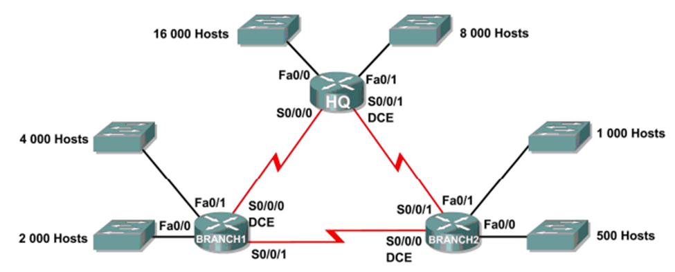

# Lab 6.1: Análise e Correção de Design VLSM

## Descrição da Atividade

Nesta atividade, o endereço de rede `172.16.128.0/17` foi utilizado para fornecer o endereçamento IP da rede mostrada no Diagrama de Topologia. O VLSM foi usado para criar sub-redes, mas o plano de endereçamento resultante contém vários erros. O objetivo é diagnosticar os problemas de endereçamento, determinar onde os erros estão localizados e, em seguida, propor e documentar as atribuições de endereçamento corretas.



## Tabela de Endereçamento Inicial (Incorreta)

A análise a seguir baseia-se na tabela de endereçamento fornecida, que contém erros de projeto.

| Sub-rede | Número de endereços IP necessários | Endereço de rede |
| :--- | :--- | :--- |
| LAN1 da HQ | 16.000 | 172.16.128.0/19 |
| LAN2 da HQ | 8.000 | 172.16.192.0/18 |
| LAN1 da Branch1 | 4.000 | 172.16.224.0/20 |
| LAN2 da Branch1 | 2.000 | 172.16.240.0/21 |
| LAN1 da Branch2 | 1.000 | 172.16.244.0/24 |
| LAN2 da Branch2 | 500 | 172.16.252.0/23 |
| Link da HQ para a Branch1 | 2 | 172.16.254.0/28 |
| Link da HQ para a Branch2 | 2 | 172.16.254.16/30 |
| Link da Branch1 para a Branch2 | 2 | 172.16.254.48/30 |

---

## Diagnóstico dos Problemas

A tabela de endereçamento inicial apresenta múltiplos erros críticos que tornam a rede disfuncional:

1.  **Alocação de Tamanho Incorreto:**
    *   A sub-rede **HQ LAN1** precisa de 16.000 endereços, mas a máscara `/19` só fornece 8.192 endereços (2^(32-19) = 2^13 = 8.192). A rede é pequena demais.
    *   A sub-rede **Branch2 LAN1** precisa de 1.000 endereços, mas a máscara `/24` só fornece 256 endereços (2^(32-24) = 2^8 = 256). A rede é pequena demais.
    *   A sub-rede **HQ LAN2** precisa de 8.000 endereços, mas recebeu um bloco `/18` com 16.384, um desperdício de recursos.
    *   O link **HQ para Branch1** recebeu uma máscara `/28` (14 hosts) quando uma `/30` (2 hosts) seria suficiente.

2.  **Sobreposição de Sub-redes:** Este é o erro mais grave. As sub-redes foram alocadas de tal forma que se sobrepõem.
    *   A sub-rede **HQ LAN2 (`172.16.192.0/18`)** tem um intervalo de `172.16.192.0` a `172.16.255.255`.
    *   Todas as outras sub-redes (exceto a HQ LAN1) foram alocadas dentro deste intervalo, causando um conflito massivo. Por exemplo, a **Branch1 LAN1 (`172.16.224.0/20`)** está contida na rede da HQ LAN2. O roteamento entre elas é impossível.

3.  **Ordenação Incorreta:** O princípio fundamental do VLSM é alocar as sub-redes da maior para a menor. A tabela falha em seguir essa ordem (por exemplo, aloca um `/19` antes de um `/18`), o que leva à fragmentação do espaço de endereços e torna a alocação correta impossível.

---

### **Tarefa 1: Examine o endereçamento para LANs HQ**

**Passo 1: Sub-rede HQ LAN1**

1.  **Quantos endereços IP são necessários?**
    *   **Resposta:** 16.000.
2.  **Quantos endereços IP estão disponíveis na sub-rede atualmente atribuída (`172.16.128.0/19`)?**
    *   **Resposta:** 8.192.
3.  **A sub-rede atualmente atribuída atenderá aos requisitos de tamanho?**
    *   **Resposta:** **Não.** A rede é muito pequena.
4.  **Se não, proponha uma nova máscara de sub-rede...**
    *   **Resposta:** Uma máscara `/18` (ou `255.255.192.0`) é necessária para fornecer 16.384 endereços.
5.  **A sub-rede se sobrepõe a alguma das outras?**
    *   **Resposta:** **Não.** No entanto, o problema principal é o tamanho insuficiente.
6.  **Se sim, proponha uma nova máscara/endereço...**
    *   **Resposta:** A primeira sub-rede (a maior) deve ser `172.16.128.0/18`.

**Passo 2: Sub-rede LAN2 HQ**

1.  **Quantos endereços IP são necessários?**
    *   **Resposta:** 8.000.
2.  **Quantos endereços IP estão disponíveis na sub-rede atualmente atribuída (`172.16.192.0/18`)?**
    *   **Resposta:** 16.384.
3.  **A sub-rede atualmente atribuída atenderá aos requisitos de tamanho?**
    *   **Resposta:** **Sim**, mas é muito maior que o necessário, desperdiçando endereços.
4.  **Se não, proponha uma nova máscara de sub-rede...**
    *   **Resposta:** Uma máscara `/19` (8.192 endereços) seria a ideal.
5.  **A sub-rede se sobrepõe a alguma das outras?**
    *   **Resposta:** **Sim.** Esta sub-rede (`172.16.192.0` - `172.16.255.255`) se sobrepõe a todas as sub-redes das Filiais (Branches) e aos links WAN.
6.  **Se sim, proponha uma nova máscara/endereço...**
    *   **Resposta:** Seguindo um plano VLSM correto, a sub-rede deveria ser `172.16.192.0/19`, alocada após a sub-rede da HQ LAN1.

---

### **Tarefa 2: Examine o endereçamento para LANs Branch1**

**Passo 1: Sub-rede LAN1 da Branch1**

1.  **Quantos endereços IP são necessários?**
    *   **Resposta:** 4.000.
2.  **Quantos endereços IP estão disponíveis na sub-rede atualmente atribuída (`172.16.224.0/20`)?**
    *   **Resposta:** 4.096.
3.  **A sub-rede atualmente atribuída atenderá ao requisito de tamanho?**
    *   **Resposta:** **Sim.**
4.  **A sub-rede se sobrepõe a alguma das outras?**
    *   **Resposta:** **Sim.** Ela está dentro do intervalo da sub-rede HQ LAN2.
5.  **Se sim, proponha uma nova máscara/endereço...**
    *   **Resposta:** A sub-rede correta, seguindo o plano VLSM, seria `172.16.224.0/20`, mas alocada no espaço livre após as redes da HQ.

**Passo 2: Sub-rede LAN2 da Branch1**

1.  **Quantos endereços IP são necessários?**
    *   **Resposta:** 2.000.
2.  **Quantos endereços IP estão disponíveis na sub-rede atualmente atribuída (`172.16.240.0/21`)?**
    *   **Resposta:** 2.048.
3.  **A sub-rede atualmente atribuída atenderá ao requisito de tamanho?**
    *   **Resposta:** **Sim.**
4.  **A sub-rede se sobrepõe a alguma das outras?**
    *   **Resposta:** **Sim.** Ela também está dentro do intervalo da sub-rede HQ LAN2.
5.  **Se sim, proponha um novo endereço de rede...**
    *   **Resposta:** A sub-rede correta seria `172.16.240.0/21`, alocada após a LAN1 da Branch1.

---

### **Tarefa 3: Examine o endereçamento para LANs Branch2 e Links WAN**

(As tarefas para a Branch2 e os links WAN seguem o mesmo padrão de erros: sobreposição com a HQ LAN2 e, em alguns casos, tamanho incorreto.)

*   **Branch2 LAN1:** Precisa de 1.000 hosts, mas recebeu uma `/24` (256 hosts). **Tamanho insuficiente** e **sobreposição**.
*   **Branch2 LAN2:** Tamanho `/23` (512 hosts) é adequado para 500 hosts, mas há **sobreposição**.
*   **Links WAN:** Todos os links estão em **sobreposição** com a HQ LAN2. O link HQ-Branch1 também é **ineficiente** (`/28` em vez de `/30`).

---

### **Tarefa 4: Documente as informações de endereçamento corrigidas**

Para corrigir todos os erros, a alocação deve seguir o método VLSM, ordenando as redes da maior para a menor necessidade de hosts. Isso resulta na seguinte tabela de endereçamento, que é otimizada, funcional e não possui sobreposições.

| Sub-rede | Hosts Necessários | Bloco de Endereços | Máscara de Rede | Endereço de Rede | Intervalo de Hosts | Endereço de Broadcast |
| :--- | :--- | :--- | :--- | :--- | :--- | :--- |
| **HQ LAN1** | 16.000 | 16.384 (/18) | 255.255.192.0 | `172.16.128.0` | `172.16.128.1` - `172.16.191.254` | `172.16.191.255` |
| **HQ LAN2** | 8.000 | 8.192 (/19) | 255.255.224.0 | `172.16.192.0` | `172.16.192.1` - `172.16.223.254` | `172.16.223.255` |
| **Branch1 LAN1** | 4.000 | 4.096 (/20) | 255.255.240.0 | `172.16.224.0` | `172.16.224.1` - `172.16.239.254` | `172.16.239.255` |
| **Branch1 LAN2** | 2.000 | 2.048 (/21) | 255.255.248.0 | `172.16.240.0` | `172.16.240.1` - `172.16.247.254` | `172.16.247.255` |
| **Branch2 LAN1** | 1.000 | 1.024 (/22) | 255.255.252.0 | `172.16.248.0` | `172.16.248.1` - `172.16.251.254` | `172.16.251.255` |
| **Branch2 LAN2** | 500 | 512 (/23) | 255.255.254.0 | `172.16.252.0` | `172.16.252.1` - `172.16.253.254` | `172.16.253.255` |
| **Link WAN 1** | 2 | 4 (/30) | 255.255.255.252 | `172.16.254.0` | `172.16.254.1` - `172.16.254.2` | `172.16.254.3` |
| **Link WAN 2** | 2 | 4 (/30) | 255.255.255.252 | `172.16.254.4` | `172.16.254.5` - `172.16.254.6` | `172.16.254.7` |
| **Link WAN 3** | 2 | 4 (/30) | 255.255.255.252 | `172.16.254.8` | `172.16.254.9` - `172.16.254.10` | `172.16.254.11` |

---

### **Exemplo de Implementação (Roteador HQ)**

A seguir, um exemplo de como as interfaces do roteador HQ seriam configuradas em um sistema operacional Cisco IOS para aplicar o plano de endereçamento corrigido.

```c#
! Entrando no modo de configuração global
configure terminal

! Configuração da interface para a HQ LAN1
interface FastEthernet0/0
 description Conexao para a LAN1 da Sede (16.000 hosts)
 ip address 172.16.128.1 255.255.192.0
 no shutdown

! Configuração da interface para a HQ LAN2
interface FastEthernet0/1
 description Conexao para a LAN2 da Sede (8.000 hosts)
 ip address 172.16.192.1 255.255.224.0
 no shutdown

! Configuração da interface serial para a Branch1
interface Serial0/0/0
 description Link WAN para a Filial 1
 ip address 172.16.254.1 255.255.255.252
 no shutdown

! Configuração da interface serial para a Branch2
interface Serial0/0/1
 description Link WAN para a Filial 2
 ip address 172.16.254.5 255.255.255.252
 no shutdown

end
```

---

## Conclusão

Este laboratório demonstrou a importância crítica do planejamento de rede e a aplicação correta do VLSM (Variable Length Subnet Masking). Ao diagnosticar o cenário inicial, onde a alocação incorreta de sub-redes resultou em sobreposições e tamanhos inadequados, ficou claro que um plano de endereçamento mal executado torna a rede completamente inoperante. Na prática, isso significaria uma interrupção total da comunicação entre a sede e as filiais, impedindo operações de negócio e o acesso a recursos críticos.

A solução corrigida, aplicando o método VLSM de forma ordenada (das maiores para as menores necessidades de hosts), resultou em um esquema de endereçamento IP eficiente, sem desperdício de endereços e sem sobreposições. Cada segmento da rede (LAN ou WAN) recebeu um bloco de tamanho apropriado, garantindo a comunicação, o roteamento e a escalabilidade futura da topologia.

---

## Referências e Leitura Adicional

*   [Cisco: IP Addressing and Subnetting for New Users](https://www.cisco.com/c/en/us/support/docs/ip/routing-information-protocol-rip/13788-3.html)
*   [GeeksForGeeks: Variable Length Subnet Masking (VLSM)](https://www.geeksforgeeks.org/computer-networks/virtual-length-subnet-mask-vlsm-in-ip-networking/)
*   [Study CCNA: VLSM](https://study-ccna.com/variable-length-subnet-mask-vlsm/)
*   [Comparitech: VLSM Tutorial](https://www.comparitech.com/net-admin/variable-length-subnet-mask-vlsm-tutorial/)
*   [IP Subnet Calculator (Ferramenta)](https://calculator.net/ip-subnet-calculator.html)
