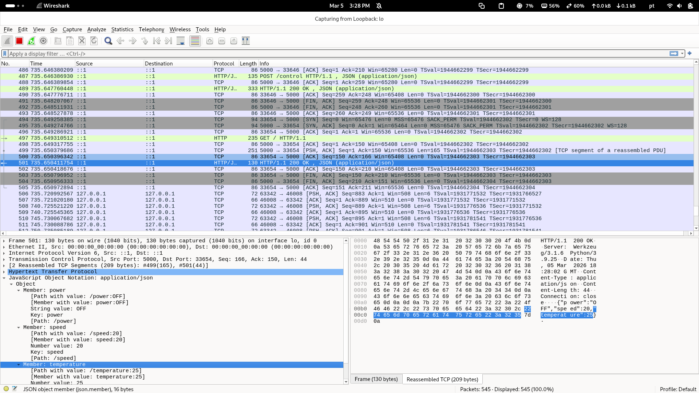

# Atividade #2 - Comunicação Cliente–Servidor usando Docker

## Antecedentes: Protocolos de comunicação

**Objetivo:** Implementar e analisar uma comunicação HTTP real executada dentro de containers Docker.

## Descrição da atividade

É fornecido um servidor backend desenvolvido com Flask que simula o comportamento de um dispositivo. Você deve executar este servidor dentro de um container Docker e desenvolver um ou mais clientes que se comuniquem com ele de forma remota, analisando o tráfego de rede gerado.

### Requisitos Prévios

Antes da execução, instale os pacotes necessários:

```bash
pip install Flask requests
```

### Implementação do Servidor (app.py)

O servidor Flask simula o estado de um dispositivo (velocidade, temperatura, energia) e permite atualizações via POST.

```python
from flask import Flask, request, jsonify
import logging

app = Flask(__name__)
logging.basicConfig(level=logging.INFO)

device_status = {
    "speed": 0,
    "temperature": 25,
    "power": "OFF"
}

@app.route('/', methods=['GET'])
def get_status():
    return jsonify(device_status), 200

@app.route('/control', methods=['POST'])
def control_device():
    data = request.get_json()
    if not data:
        return jsonify({"error": "No JSON payload provided"}), 400

    client_id = data.get("client_id")
    command_type = data.get("type")
    value = data.get("value")

    if command_type in device_status:
        device_status[command_type] = value
        app.logger.info(f"Client {client_id} updated {command_type} to {value}")
        return jsonify({"status": "success", "updated_status": device_status}), 200
    else:
        return jsonify({"error": f"Invalid command type: {command_type}"}), 400

if __name__ == '__main__':
    app.run(host='0.0.0.0', port=5000)
```

### Dockerfile

```dockerfile
FROM python:3.9-slim
WORKDIR /app
COPY requirements.txt .
RUN pip install --no-cache-dir -r requirements.txt
COPY app.py .
EXPOSE 5000
CMD ["python", "app.py"]
```

### Implementação do Cliente (client.py)

Exemplo de payload a enviar:

```json
{
  "client_id": 1223,
  "type": "speed",
  "value": 20
}
```

```python
import requests
import json

BASE_URL = "http://localhost:5000"

def send_command(client_id, command_type, value):
    payload = {"client_id": client_id, "type": command_type, "value": value}
    response = requests.post(f"{BASE_URL}/control", json=payload)
    print(f"Resposta do Servidor: {json.dumps(response.json(), indent=2)}")

if __name__ == "__main__":
    send_command(client_id=1223, command_type="speed", value=20)
```

## Como Executar

1. **Construir a imagem Docker:**
   ```bash
   docker build -t flask-device-sim ./atividade-2
   ```

2. **Executar o container:**
   ```bash
   docker run -p 5000:5000 flask-device-sim
   ```

3. **Executar o cliente (em outro terminal):**
   ```bash
   python atividade-2/client.py
   ```

## Captura e Análise de Tráfego (Wireshark)

Para validar a comunicação, o tráfego foi capturado na interface de loopback (`lo`) filtrando pela porta 5000.



**Observações da Captura:**

1.  **Three-Way Handshake:** No frame 494 ao 496, é possível observar o estabelecimento da conexão TCP com as flags `[SYN]`, `[SYN, ACK]` e `[ACK]`, confirmando a natureza confiável do protocolo TCP.
2.  **Requisição POST:** No frame 487, vemos o cliente enviando o comando para alterar o status do dispositivo via `POST /control`, carregando o payload JSON: `{"client_id": 1223, "type": "speed", "value": 20}`.
3.  **Requisição GET:** No frame 497, o cliente solicita o status atual do dispositivo para confirmar a alteração.
4.  **Resposta HTTP 200 OK:** No frame 501 (selecionado na imagem), o servidor responde com o status 200 OK e o corpo da mensagem contendo o JSON: `{"power": "OFF", "speed": 20, "temperature": 25}`, confirmando o sucesso da operação.

## Perguntas de Reflexão do Laboratório

1. **Quais camadas do modelo OSI intervêm quando um comando HTTP é enviado?**
   Ao executar essa atividade, percebo que minha interação percorre quase toda a pilha OSI. Na **Camada 7 (Aplicação)**, utilizo o protocolo HTTP para estruturar meus dados em um formato que o servidor Flask compreenda. Na **Camada 6 (Apresentação)**, o Flask e minha biblioteca `requests` lidam com a serialização do JSON. Na **Camada 4 (Transporte)**, observo a criação de uma conexão TCP, que garante a integridade dos dados através de confirmações (ACKs). A **Camada 3 (Rede)** entra em cena com o protocolo IP, endereçando os pacotes entre meu cliente e o container. Por fim, nas **Camadas 2 (Enlace)** e **1 (Física)**, os dados são encapsulados em quadros Ethernet e transmitidos como sinais elétricos ou ópticos pela infraestrutura de rede, permitindo que os bits cheguem ao destino.

2. **Qual vantagem o TCP oferece frente ao UDP neste cenário?**
   Neste cenário de controle de dispositivos, optei pelo **TCP (Transmission Control Protocol)** devido à sua natureza orientada à conexão e confiável. Diferente do UDP, que envia pacotes sem garantia de entrega (best-effort), o TCP utiliza o *three-way handshake* para estabelecer a sessão e mecanismos de retransmissão caso algum pacote seja perdido ou chegue corrompido. Para mim, é crítico que um comando de "ajuste de velocidade" chegue exatamente como enviado; se eu usasse UDP, um comando perdido poderia deixar o dispositivo em um estado inconsistente ou perigoso, sem que eu recebesse qualquer aviso sobre a falha.

3. **O que muda na comunicação quando o servidor é executado dentro do Docker?**
   Ao isolar o servidor em um container Docker, notei que a topologia de rede se torna mais complexa. O Docker cria uma **ponte de rede virtual (bridge)**, onde o container recebe um endereço IP privado dentro de um namespace isolado. Para que eu consiga acessar o servidor do meu host, precisei configurar o **redirecionamento de portas (Port Forwarding)**. Isso significa que o Docker Engine atua realizando um DNAT (Destination Network Address Translation), mapeando as requisições que chegam na porta 5000 do meu `localhost` para o IP interno e a porta do container, tornando a rede transparente para a aplicação, mas adicionando uma camada lógica de mediação.

4. **Como este sistema escalaria para centenas de clientes?**
   Para escalar essa solução, eu implementaria uma arquitetura de **Escalabilidade Horizontal**. Em vez de um único container, eu utilizaria um orquestrador como o **Kubernetes** ou o **Docker Swarm** para gerenciar múltiplas instâncias do servidor Flask. Eu colocaria um **Balanceador de Carga (Load Balancer)**, como o Nginx ou HAProxy, na frente desses containers para distribuir as requisições de forma equitativa. Além disso, eu precisaria garantir que o estado do dispositivo não ficasse apenas na memória do Flask, mas sim em um banco de dados externo ou cache distribuído (como o Redis), permitindo que qualquer instância pudesse responder a qualquer cliente sem perda de informação.

5. **Quais problemas de rede poderiam aparecer em um ambiente real?**
   Em uma implementação de produção, eu teria que lidar com desafios que não aparecem no ambiente controlado do laboratório. A **Latência de Rede** e o **Jitter** poderiam causar atrasos perceptíveis no controle do dispositivo. A **Congestão de Rede** poderia levar à perda de pacotes, forçando o TCP a retransmitir e diminuir a vazão. Além disso, a segurança seria uma preocupação central: eu precisaria implementar **TLS/SSL (HTTPS)** para criptografar os dados na Camada 6 e utilizar mecanismos de **Autenticação e Autorização (como JWT)** para garantir que apenas clientes autorizados pudessem enviar comandos, protegendo o sistema contra ataques de interceptação ou injeção de comandos.