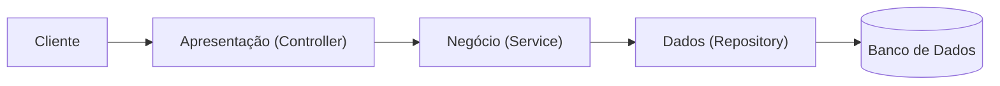

# Impacto da Não Utilização de uma Arquitetura em Camadas (MLA)

## Introdução

Este documento analisa as consequências negativas de não adotar uma Arquitetura em Camadas (Multi-Layer Architecture - MLA) em um projeto de desenvolvimento de software. A ausência dessa abordagem arquitetural resulta em um sistema monolítico, difícil de manter, testar e escalar. Exploraremos como isso afetaria os controladores, violaria princípios de código limpo, dificultaria os testes e criaria grandes problemas na migração de tecnologias de banco de dados.

---

## Como seria o código nos seus controladores?

Sem uma MLA, os controladores se tornam o centro de toda a lógica da aplicação. Eles recebem a requisição HTTP, validam os dados, executam a lógica de negócio e interagem diretamente com o banco de dados. Isso resulta em "Controladores Gordos" (Fat Controllers) que misturam responsabilidades, tornando o código confuso, repetitivo e frágil.

### Exemplo: Controlador sem MLA

Imagine um controlador para criar um usuário. Ele faria tudo:

```c#
// UserController.cs - SEM Arquitetura em Camadas

public class UserController : ControllerBase
{
    private readonly string _connectionString = "Server=myServer;Database=myDataBase;User Id=myUser;Password=myPassword;";

    [HttpPost]
    public IActionResult CreateUser([FromBody] UserDto userData)
    {
        // 1. Validação de Apresentação
        if (string.IsNullOrEmpty(userData.Name) || string.IsNullOrEmpty(userData.Email))
        {
            return BadRequest("Name and email are required.");
        }

        // 2. Lógica de Negócio (ex: verificar se email já existe)
        using (var connection = new SqlConnection(_connectionString))
        {
            connection.Open();
            var command = new SqlCommand("SELECT COUNT(1) FROM Users WHERE Email = @Email", connection);
            command.Parameters.AddWithValue("@Email", userData.Email);

            var userExists = (int)command.ExecuteScalar() > 0;
            if (userExists)
            {
                return Conflict("A user with this email already exists.");
            }

            // 3. Lógica de Acesso a Dados (Inserção)
            var insertCommand = new SqlCommand("INSERT INTO Users (Name, Email, PasswordHash) VALUES (@Name, @Email, @PasswordHash)", connection);
            insertCommand.Parameters.AddWithValue("@Name", userData.Name);
            insertCommand.Parameters.AddWithValue("@Email", userData.Email);
            // A lógica de hash de senha também estaria aqui, misturada.
            insertCommand.Parameters.AddWithValue("@PasswordHash", BCrypt.Net.BCrypt.HashPassword(userData.Password)); 
            
            insertCommand.ExecuteNonQuery();
        }

        // 4. Resposta da Apresentação
        return StatusCode(201, "User created successfully.");
    }
}
```

Neste exemplo, o controlador tem conhecimento sobre:
1.  **Regras de apresentação** (dados de entrada, respostas HTTP).
2.  **Regras de negócio** (verificar a existência de um usuário).
3.  **Detalhes de infraestrutura** (string de conexão, SQL, biblioteca de hash).

---

## Quais princípios do Código Limpo (Clean Code) seriam violados?

A abordagem monolítica no controlador viola diretamente vários princípios fundamentais do Clean Code:

1.  **Princípio da Responsabilidade Única (SRP - Single Responsibility Principle):** Este é o princípio mais violado. O controlador tem múltiplas responsabilidades: gerenciar requisições HTTP, validar dados, orquestrar a lógica de negócio e acessar o banco de dados. Uma classe deve ter apenas um motivo para mudar. No nosso exemplo, o controlador mudaria se a regra de negócio mudasse, se o schema do banco de dados mudasse, ou se a resposta da API mudasse.

2.  **Não se Repita (DRY - Don't Repeat Yourself):** Se outra parte do sistema precisasse verificar se um usuário existe ou criar um novo usuário (por exemplo, um painel de administrador), a lógica de consulta ao banco de dados e de inserção seria copiada e colada, levando a duplicação de código.

3.  **Código Expressivo e Legível:** Funções longas que fazem muitas coisas são difíceis de ler e entender. É difícil identificar rapidamente qual é a regra de negócio principal em meio a tanto código de infraestrutura (SQL, conexões, etc.).

---

## Como você poderia testar?

Testar uma aplicação sem MLA é um pesadelo. A falta de separação de interesses torna os testes unitários praticamente impossíveis.

*   **Testes Unitários:** Para testar a lógica de negócio (por exemplo, "o sistema impede a criação de usuários com e-mails duplicados"), você não conseguiria isolar essa lógica. Seria necessário ter um banco de dados real em execução para que o teste pudesse rodar, o que transforma um teste unitário em um teste de integração. Isso torna os testes lentos, frágeis (podem falhar por problemas de rede ou configuração do BD) e complexos de configurar.

*   **Testes de Integração:** Essencialmente, todos os seus testes se tornariam testes de integração, verificando a colaboração entre o controlador e o banco de dados. Embora úteis, eles não substituem a velocidade e a precisão dos testes unitários para validar regras de negócio específicas.

*   **Mocks e Stubs:** Isolar o controlador do banco de dados para um teste unitário seria extremamente difícil. Você não pode simplesmente "mockar" uma chamada de método, pois a lógica do banco de dados está entrelaçada dentro do próprio método do controlador.

---

## Que problemas você identifica ao querer mudar a tecnologia de banco de dados?

Mudar o banco de dados (por exemplo, de SQL Server para MongoDB) em um projeto sem MLA seria uma tarefa monumental, arriscada e cara.

O problema central é o **acoplamento forte** (tight coupling) entre a lógica da aplicação e a tecnologia de banco de dados.

1.  **Código Específico do Fornecedor Espalhado:** O código SQL, as strings de conexão e as chamadas a bibliotecas específicas (como `System.Data.SqlClient`) estariam espalhados por todos os controladores da aplicação.

2.  **Refatoração Massiva:** Para migrar para o MongoDB, seria necessário encontrar e reescrever cada pedaço de código que interage com o banco de dados em toda a base de código. Cada `SqlCommand` teria que ser substituído por chamadas à API do driver do MongoDB.

3.  **Alto Risco de Erros:** Uma mudança tão invasiva e manual tem uma alta probabilidade de introduzir bugs. Seria fácil esquecer de converter uma consulta ou fazê-lo incorretamente, resultando em comportamento inesperado na aplicação.

### O Contraste com MLA

Com uma MLA, a lógica de acesso a dados estaria isolada em uma camada de Repositório. Para mudar de SQL Server para MongoDB, bastaria criar uma nova implementação da interface do repositório (`MongoUserRepository` em vez de `SqlUserRepository`). O resto da aplicação (camadas de Serviço e Apresentação) não precisaria de nenhuma modificação, pois depende da abstração (a interface) e não da implementação concreta.

## Diagramas de Arquitetura

### Sem MLA (Monolítico)
```
+--------------------------------------------------+
| Cliente (Browser/App)                            |
+--------------------------------------------------+
                 |
                 v
+--------------------------------------------------+
| Controlador                                      |
| - Lógica de Apresentação (HTTP)                  |
| - Lógica de Negócio (Regras)                     |
| - Lógica de Acesso a Dados (SQL)                 |
+--------------------------------------------------+
                 |
                 v
+--------------------------------------------------+
| Banco de Dados                                   |
+--------------------------------------------------+
```

### Com MLA (Arquitetura em Camadas)

