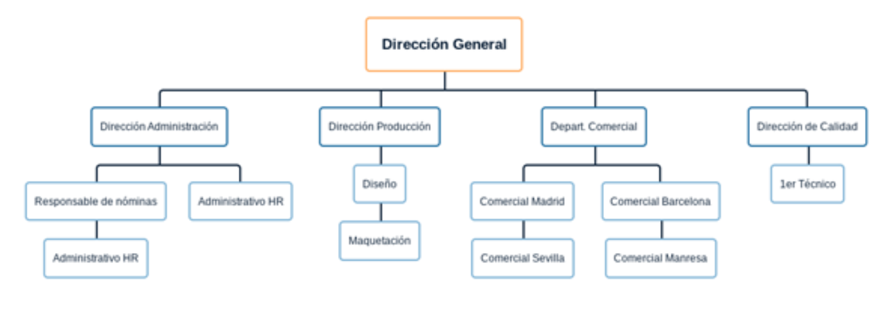

# Atividade de Análise de Rede

### 1. Impacto da Disseminação de Arquivos Grandes

**Cenário:** Três redes, cada uma com 550 hosts, sofrem uma disseminação massiva de pacotes de um filme popular da Netflix.

**Análise:**

Uma rede projetada para suportar 550 hosts por sub-rede seria, provavelmente, um único e grande domínio de broadcast (por exemplo, usando uma máscara `/22`, que permite 1022 hosts). O cenário descrito implica um evento de broadcast ou multicast, onde os mesmos pacotes são enviados para muitos ou todos os hosts simultaneamente.

*   **Congestionamento:** A transmissão simultânea de pacotes de vídeo grandes para 1650 hosts (550 hosts x 3 redes) geraria uma quantidade enorme de tráfego. Isso saturaria rapidamente os links de rede, incluindo switches, roteadores e, potencialmente, o link de subida para a internet.
*   **Tempestade de Broadcast (Broadcast Storm):** Se a disseminação ocorrer por meio de pacotes de broadcast dentro de cada uma das três grandes sub-redes, cada um dos 550 dispositivos em cada sub-rede receberia e processaria esses pacotes. Isso é conhecido como "tempestade de broadcast". O volume imenso de tráfego de broadcast consumiria uma porção significativa da largura de banda disponível e dos recursos de CPU de todos os dispositivos conectados, independentemente de o dispositivo estar ou não "assistindo" ao filme.
*   **Degradação de Desempenho:** A consequência imediata seria uma degradação severa do desempenho da rede. O tráfego legítimo sofreria com alta latência, jitter e perda de pacotes. Aplicações como VoIP, jogos online e até a simples navegação na web se tornariam lentas ou inutilizáveis.
*   **Colapso da Rede:** No pior cenário, a tempestade de broadcast poderia sobrecarregar os equipamentos de rede, fazendo com que switches e roteadores travassem ou parassem de responder, levando a uma interrupção total da rede para os três segmentos.

**Conclusão:** A disseminação de arquivos grandes via broadcast em sub-redes extensas é altamente ineficiente e perigosa. Provavelmente, levaria a um grave congestionamento da rede e poderia até causar um colapso completo da rede. Serviços de streaming modernos como a Netflix usam conexões unicast (ponto a ponto) e, para eventos ao vivo, empregam estratégias sofisticadas de multicast e redes de distribuição de conteúdo (CDN) para evitar tais problemas.

---

### 2. Divisão de Sub-redes para a Empresa X

Para segmentar eficientemente a rede da Empresa X, usaremos a Máscara de Sub-rede de Comprimento Variável (VLSM) com base no número de hosts necessários para cada departamento. Usaremos o espaço de endereço privado `192.168.1.0/24` como nosso ponto de partida.

O organograma é o seguinte:

Os departamentos são ordenados do maior para o menor em número de hosts necessários para facilitar a alocação.

1.  **Departamento Comercial:** 24 hosts -> Precisa de 30 IPs utilizáveis -> `2^5 - 2 = 30`. Requer uma máscara `/27`.
2.  **Direção Administrativa:** 20 hosts -> Precisa de 30 IPs utilizáveis -> `2^5 - 2 = 30`. Requer uma máscara `/27`.
3.  **Direção de Produção:** 12 hosts -> Precisa de 14 IPs utilizáveis -> `2^4 - 2 = 14`. Requer uma máscara `/28`.
4.  **Direção Geral:** 4 hosts -> Precisa de 6 IPs utilizáveis -> `2^3 - 2 = 6`. Requer uma máscara `/29`.
5.  **Direção de Qualidade:** 2 hosts -> Precisa de 2 IPs utilizáveis -> `2^2 - 2 = 2`. Requer uma máscara `/30`.

Aqui está a alocação detalhada das sub-redes:

| Departamento | Endereço de Rede | Intervalo de Hosts Utilizáveis | Endereço de Broadcast | Máscara de Sub-rede |
| :--- | :--- | :--- | :--- | :--- |
| Dept. Comercial | `192.168.1.0/27` | `192.168.1.1` - `192.168.1.30` | `192.168.1.31` | `255.255.255.224` |
| Dir. Administrativa | `192.168.1.32/27` | `192.168.1.33` - `192.168.1.62` | `192.168.1.63` | `255.255.255.224` |
| Dir. de Produção | `192.168.1.64/28` | `192.168.1.65` - `192.168.1.78` | `192.168.1.79` | `255.255.255.240` |
| Dir. Geral | `192.168.1.80/29` | `192.168.1.81` - `192.168.1.86` | `192.168.1.87` | `255.255.255.248` |
| Dir. de Qualidade | `192.168.1.88/30` | `192.168.1.89` - `192.168.1.90` | `192.168.1.91` | `255.255.255.252` |

**Justificativa:** Este projeto com VLSM é altamente eficiente. Ele aloca endereços IP com base nas necessidades específicas de cada departamento, minimizando o desperdício de endereços. Ao atribuir máscaras de tamanhos diferentes, garantimos que cada sub-rede tenha espaço suficiente para seus hosts atuais e algum crescimento futuro, sem reservar um número excessivo de IPs não utilizados, o que é um problema comum na divisão de sub-redes de tamanho fixo.

---

### 3. Classes de Endereços IP

Aqui estão os intervalos para as diferentes classes de endereços IP:

| Classe | IP Inicial | IP Final | Bits de Rede/Host | Máscara Padrão |
| :--- | :--- | :--- | :--- | :--- |
| **A** | `1.0.0.0` | `126.255.255.255` | 8 Rede / 24 Host | `/8` |
| **B** | `128.0.0.0` | `191.255.255.255` | 16 Rede / 16 Host | `/16` |
| **C** | `192.0.0.0` | `223.255.255.255` | 24 Rede / 8 Host | `/24` |
| **D** | `224.0.0.0` | `239.255.255.255` | Multicast | N/A |
| **E** | `240.0.0.0` | `255.255.255.255` | Experimental | N/A |

*Observação: O intervalo `127.0.0.0` a `127.255.255.255` é reservado para loopback e fins de diagnóstico.*

---

### 4. Criando 16 Sub-redes a partir de 222.222.22.0/24

**Objetivo:** Criar 16 sub-redes de igual tamanho a partir da rede `222.222.22.0/24`.

1.  **Bits a Emprestar:** Para criar 16 sub-redes, precisamos emprestar `n` bits da porção de host, onde `2^n = 16`. Portanto, `n = 4` bits.
2.  **Nova Máscara de Sub-rede:** A máscara original é `/24`. Adicionamos os 4 bits emprestados a ela: `24 + 4 = 28`. A nova máscara é `/28`, que corresponde a `255.255.255.240`.
3.  **Hosts por Sub-rede:** A máscara `/24` original deixava 8 bits para hosts. Após emprestar 4, temos `8 - 4 = 4` bits restantes para a porção de host. O número de hosts por sub-rede é `2^4 - 2 = 16 - 2 = 14` hosts utilizáveis.
4.  **Incremento da Sub-rede:** O "número mágico" ou incremento entre as sub-redes é `256 - 240 (o último octeto da máscara) = 16`. Assim, cada nova sub-rede começará 16 endereços após a anterior.

Aqui estão as 16 sub-redes resultantes:

| Sub-rede # | Endereço de Rede | Intervalo de Hosts Utilizáveis | Endereço de Broadcast |
| :--- | :--- | :--- | :--- |
| 1 | `222.222.22.0/28` | `222.222.22.1` - `222.222.22.14` | `222.222.22.15` |
| 2 | `222.222.22.16/28` | `222.222.22.17` - `222.222.22.30` | `222.222.22.31` |
| 3 | `222.222.22.32/28` | `222.222.22.33` - `222.222.22.46` | `222.222.22.47` |
| 4 | `222.222.22.48/28` | `222.222.22.49` - `222.222.22.62` | `222.222.22.63` |
| 5 | `222.222.22.64/28` | `222.222.22.65` - `222.222.22.78` | `222.222.22.79` |
| 6 | `222.222.22.80/28` | `222.222.22.81` - `222.222.22.94` | `222.222.22.95` |
| 7 | `222.222.22.96/28` | `222.222.22.97` - `222.222.22.110` | `222.222.22.111` |
| 8 | `222.222.22.112/28` | `222.222.22.113` - `222.222.22.126` | `222.222.22.127` |
| 9 | `222.222.22.128/28` | `222.222.22.129` - `222.222.22.142` | `222.222.22.143` |
| 10 | `222.222.22.144/28` | `222.222.22.145` - `222.222.22.158` | `222.222.22.159` |
| 11 | `222.222.22.160/28` | `222.222.22.161` - `222.222.22.174` | `222.222.22.175` |
| 12 | `222.222.22.176/28` | `222.222.22.177` - `222.222.22.190` | `222.222.22.191` |
| 13 | `222.222.22.192/28` | `222.222.22.193` - `222.222.22.206` | `222.222.22.207` |
| 14 | `222.222.22.208/28` | `222.222.22.209` - `222.222.22.222` | `222.222.22.223` |
| 15 | `222.222.22.224/28` | `222.222.22.225` - `222.222.22.238` | `222.222.22.239` |
| 16 | `222.222.22.240/28` | `222.222.22.241` - `222.222.22.254` | `222.222.22.255` |

---

### Referências e Ferramentas Úteis

* https://www.calculator.net/ip-subnet-calculator.html
* https://www.youtube.com/watch?v=CKBWCaiZrsw