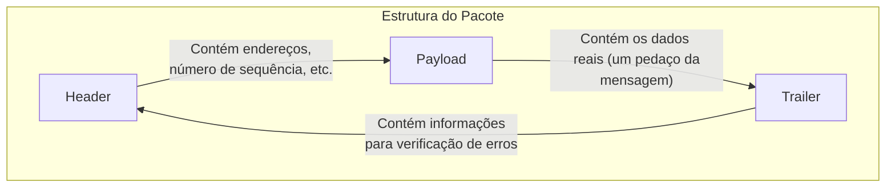
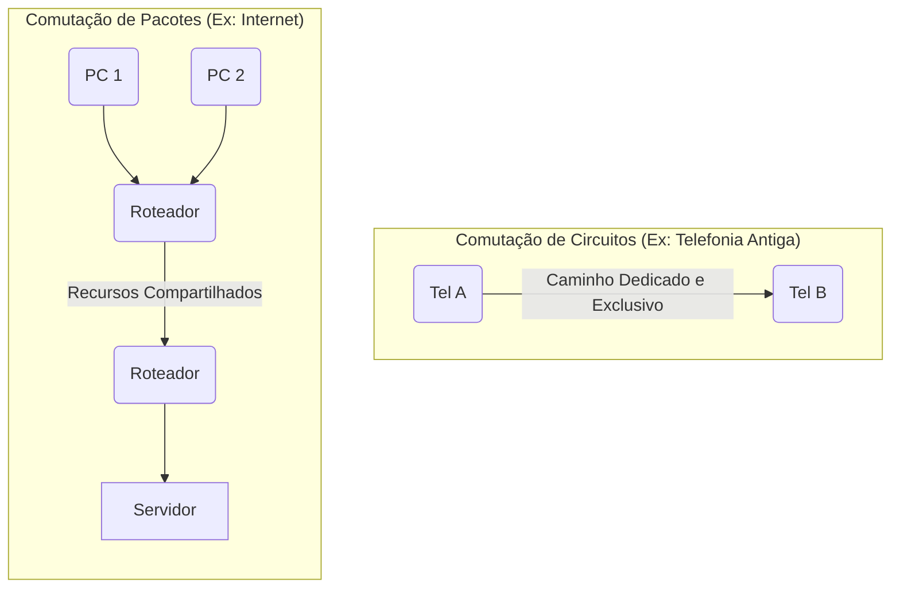

# Comutação de Pacotes (Packet Switching)

A comutação de pacotes é o método fundamental pelo qual os dados são transferidos em redes digitais modernas, como a Internet. Diferente de criar um caminho único e dedicado, essa técnica divide as informações em blocos menores, chamados **pacotes**, que são enviados de forma independente e podem seguir rotas diferentes até o destino.

## A Estrutura de um Pacote

Cada pacote é como um pequeno envelope digital. Ele consiste em três partes principais:



*   **Cabeçalho (Header):** Contém informações cruciais para o roteamento, como o endereço IP de origem, o endereço IP de destino e um número de sequência, que indica a posição do pacote na mensagem original.
*   **Carga Útil (Payload):** É o "recheio" do pacote, contendo o fragmento real dos dados que estão sendo enviados (um pedaço do e-mail, da imagem, etc.).
*   **Rodapé (Trailer):** Geralmente contém um mecanismo de verificação de erros, como um *checksum*, que permite ao dispositivo receptor verificar se o pacote foi corrompido durante a transmissão.

## Como Funciona o Processo?

A comutação de pacotes é um método "sem conexão" (*connectionless*), o que significa que nenhum circuito físico é estabelecido antes do envio dos dados. O processo segue os seguintes passos:

1.  **Fragmentação:** A mensagem original é dividida em pacotes.
2.  **Endereçamento:** Cada pacote recebe seu cabeçalho e rodapé.
3.  **Roteamento Independente:** Os pacotes são enviados para a rede. Cada roteador no caminho examina o endereço de destino no cabeçalho e, com base nas condições da rede (tráfego, congestionamento), decide para qual "salto" (o próximo roteador) deve enviar o pacote. Pacotes da mesma mensagem podem seguir rotas completamente diferentes.
4.  **Remontagem:** Ao chegarem ao destino, os pacotes são reorganizados na ordem correta, usando os números de sequência. Se um pacote estiver faltando ou corrompido (verificado pelo rodapé), o dispositivo receptor solicita ao remetente que o reenvie.

O diagrama abaixo ilustra como pacotes da mesma mensagem podem usar rotas diferentes para contornar o congestionamento da rede.

```mermaid
graph TD
    A[Origem] --> MSG{Mensagem};
    MSG --> P1(Pacote 1);
    MSG --> P2(Pacote 2);
    MSG --> P3(Pacote 3);

    subgraph Rede (Internet)
        P1 --> R1(Roteador A);
        P2 --> R1;
        P3 --> R1;

        R1 -- Rota Padrão --> R2(Roteador B);
        R1 -- Rota Alternativa --> R3(Roteador C);

        R2 -- Congestionado --> R4(Roteador D);
        R3 -- Caminho Livre --> R4;
    end

    R4 --> REM{Remontagem};
    REM --> FIM[Destino];

    linkStyle 3 stroke:blue,stroke-width:2px;
    linkStyle 6 stroke:red,stroke-width:2px;
    linkStyle 7 stroke:green,stroke-width:2px;
    linkStyle 8 stroke:red,stroke-width:2px;
    linkStyle 9 stroke:green,stroke-width:2px;
```

## Tecnologias Essenciais

A comutação de pacotes depende de um conjunto de protocolos e dispositivos para funcionar:

*   **Protocolo de Internet (IP):** Fornece o sistema de endereçamento lógico (endereços IP) que permite que os pacotes sejam roteados pela rede global.
*   **Roteadores e Switches:** Roteadores direcionam os pacotes *entre* diferentes redes, enquanto switches gerenciam o tráfego *dentro* de uma mesma rede local (LAN).
*   **Protocolo de Controle de Transmissão (TCP):** Trabalha em conjunto com o IP (formando o par TCP/IP) para garantir a confiabilidade da transmissão. O TCP gerencia a verificação de erros, o controle de fluxo (para não sobrecarregar o receptor) e a reordenação dos pacotes no destino.

## Vantagens e Desafios

A principal vantagem da comutação de pacotes sobre a **comutação de circuitos** (onde um canal é dedicado, como em uma chamada telefônica antiga) é a eficiência.



*   **Vantagens:** Maior eficiência no uso dos recursos da rede, resiliência (pacotes podem ser reencaminhados em caso de falha) e flexibilidade.
*   **Desafios:**
    *   **Congestionamento:** Ocorre quando há mais tráfego do que a rede pode suportar. É gerenciado com técnicas de controle de fluxo e Qualidade de Serviço (QoS), que pode priorizar certos tipos de pacotes (como os de uma videochamada).
    *   **Segurança:** Como os dados trafegam em redes compartilhadas, a segurança é uma preocupação. Criptografia, firewalls e sistemas de detecção de intrusão são usados para proteger os pacotes contra interceptação e ataques.
