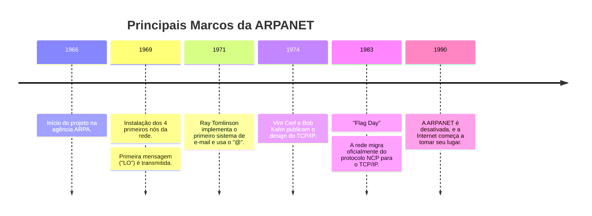

# ARPANET: O Berço da Internet

A ARPANET (Advanced Research Projects Agency Network) foi uma rede de computadores pioneira que serviu como o campo de testes para as tecnologias que hoje formam a espinha dorsal da Internet. Sua criação não foi um mero exercício acadêmico, mas uma resposta a uma necessidade estratégica no auge da Guerra Fria.

## Contexto Histórico e a Necessidade de uma Rede Robusta

Nos anos 60, o Departamento de Defesa dos EUA (DoD) estava preocupado com a vulnerabilidade de seus sistemas de comunicação, que eram centralizados e baseados em comutação de circuitos (como a rede de telefonia). Em um cenário de ataque nuclear, a destruição de um único ponto central poderia incapacitar toda a comunicação.

A ARPA (hoje DARPA) foi encarregada de financiar um projeto para criar uma rede de comando e controle descentralizada, robusta e resiliente, que pudesse sobreviver a danos parciais.

## A Inovação Central: Comutação de Pacotes

A solução para essa necessidade foi a **comutação de pacotes** (*packet switching*), um conceito revolucionário para a época, desenvolvido com base nos trabalhos teóricos de Leonard Kleinrock, Paul Baran e Donald Davies.

Em vez de dedicar um circuito físico entre dois pontos, a comutação de pacotes funciona da seguinte forma:

1.  **Fragmentação:** A mensagem original é quebrada em pequenos blocos de tamanho definido, chamados **pacotes**.
2.  **Endereçamento:** Cada pacote recebe um cabeçalho contendo informações vitais, como o endereço IP do remetente e do destinatário, e um número de sequência.
3.  **Roteamento Independente:** Os pacotes são enviados para a rede individualmente. Cada um pode seguir um caminho diferente até o destino, sendo roteado de nó em nó de forma independente.
4.  **Reagrupamento:** Ao chegar ao destino, os pacotes são reagrupados na ordem correta (usando o número de sequência) para reconstruir a mensagem original.

Essa abordagem trouxe duas vantagens cruciais:
*   **Resiliência:** Se um nó ou caminho da rede falhasse, os pacotes poderiam ser dinamicamente redirecionados por rotas alternativas, mantendo a comunicação ativa.
*   **Eficiência:** Os canais de comunicação eram compartilhados. Pacotes de múltiplas conversas podiam trafegar pela mesma linha, maximizando o uso da largura de banda.

## O Nascimento da Rede e a Primeira Mensagem

A rede física começou a ser construída em 1969. Os primeiros "roteadores", chamados **IMPs (Interface Message Processors)** — minicomputadores robustos da Honeywell — foram instalados em quatro locais:

1.  UCLA (Universidade da Califórnia, Los Angeles)
2.  Stanford Research Institute (SRI)
3.  UC Santa Barbara (UCSB)
4.  Universidade de Utah

Em **29 de outubro de 1969**, ocorreu a primeira transmissão. O programador Charley Kline, da UCLA, tentou fazer um login remoto em um computador no SRI. A intenção era digitar `LOGIN`, mas o sistema travou após as duas primeiras letras. Assim, a primeira mensagem transmitida pela ARPANET foi, acidentalmente, "**LO**".

## A Evolução para TCP/IP

O protocolo inicial da ARPANET era o NCP (Network Control Program). No entanto, o NCP foi projetado para uma única rede e não previa a interconexão de múltiplas redes heterogêneas (uma "rede de redes").

Para resolver esse problema, Vint Cerf e Bob Kahn propuseram, em 1974, uma nova arquitetura que dividia as responsabilidades:

*   **IP (Internet Protocol):** Um protocolo simples na Camada 3, responsável apenas pelo endereçamento e roteamento de pacotes entre redes distintas.
*   **TCP (Transmission Control Protocol):** Um protocolo robusto na Camada 4, responsável por garantir a entrega confiável dos dados, controlando o fluxo, a ordem e os erros.

Essa nova suíte de protocolos, o TCP/IP, tornou-se o padrão. A transição oficial de toda a rede do NCP para o TCP/IP ocorreu em **1º de janeiro de 1983**, um evento conhecido como "Flag Day", considerado por muitos o verdadeiro nascimento da Internet moderna.

## Legado e a "Killer App"

Embora o login remoto (Telnet) e a transferência de arquivos (FTP) fossem aplicações importantes, o **e-mail**, desenvolvido por Ray Tomlinson em 1971, rapidamente se tornou a "killer app" da ARPANET. Ele demonstrou o imenso potencial da rede para a comunicação humana e colaboração científica.

A ARPANET foi formalmente desativada em 1990, pois sua função foi absorvida por redes mais novas como a NSFNET, que por sua vez deu origem à Internet comercial que conhecemos hoje. O legado da ARPANET é a prova de que a comutação de pacotes e o TCP/IP eram a base sólida necessária para construir uma rede global.

### Linha do Tempo

