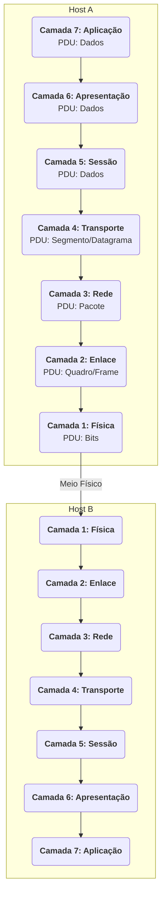

# O Modelo OSI e a Arquitetura de Protocolos

O Modelo OSI (Open Systems Interconnection), desenvolvido pela ISO, é um modelo de referência conceitual que divide as complexas funções de uma rede de computadores em sete camadas de abstração. Ele serve como um guia para o desenvolvimento de padrões e para o ensino de redes, permitindo que especialistas foquem em uma área específica e garantindo a interoperabilidade entre diferentes tecnologias.

Embora o modelo TCP/IP seja o mais implementado na prática, o Modelo OSI continua sendo a principal ferramenta pedagógica para descrever a arquitetura de rede.

## As Sete Camadas do Modelo OSI

O processo de comunicação é dividido em camadas, onde cada uma adiciona um cabeçalho (encapsulamento) aos dados recebidos da camada superior, antes de passá-los para a camada inferior.

1.  **Camada 7: Aplicação:** A camada mais próxima do usuário. Fornece a interface para que as aplicações (navegadores, clientes de e-mail) acessem os serviços de rede. 
2.  **Camada 6: Apresentação:** Garante que os dados sejam "apresentáveis" ao sistema receptor. Lida com a formatação, criptografia e compressão dos dados.
3.  **Camada 5: Sessão:** Estabelece, gerencia e encerra as sessões (conexões) entre aplicações. Controla o diálogo e a sincronização.
4.  **Camada 4: Transporte:** Responsável pela comunicação ponta a ponta (host-a-host). Oferece serviços de segmentação, controle de fluxo e correção de erros.
5.  **Camada 3: Rede:** Lida com o endereçamento lógico (endereços IP) e o roteamento de pacotes através de múltiplas redes para determinar o melhor caminho até o destino.
6.  **Camada 2: Enlace de Dados (Link):** Responsável pela transferência de quadros (frames) entre nós adjacentes em uma mesma rede. Lida com o endereçamento físico (endereços MAC) e a detecção de erros no nível do enlace.
7.  **Camada 1: Física:** Define as especificações elétricas, mecânicas e funcionais do meio físico de transmissão (cabos, fibras ópticas, sinais de rádio). Transmite os dados como um fluxo de bits.

## Mapeamento de Protocolos por Camada

A seguir, a justificativa técnica para a localização de cada protocolo dentro do modelo.

### Camada 7 (Aplicação)

*   **HTTP (Hypertext Transfer Protocol):** Define o formato das requisições e respostas trocadas entre um cliente web (navegador) e um servidor web. Por prover diretamente o serviço de navegação na web ao usuário, é um protocolo de aplicação.
*   **FTP (File Transfer Protocol):** Provê o serviço de transferência de arquivos entre hosts. Ele gerencia uma conexão de controle e múltiplas conexões de dados para realizar essa tarefa, sendo uma aplicação de rede clássica.
*   **DNS (Domain Name System):** Funciona como uma aplicação distribuída que provê o serviço de tradução de nomes de domínio (ex: `www.google.com`) para endereços IP. Outras aplicações, como o navegador, consultam o DNS para poderem iniciar uma conexão, tornando o DNS um protocolo de aplicação que serve a outras aplicações.

### Camada 4 (Transporte)

*   **TCP (Transmission Control Protocol) e UDP (User Datagram Protocol):** Ambos operam aqui, pois sua função é prover um serviço de comunicação para as aplicações da camada superior. Eles não se importam com o conteúdo dos dados, mas sim em como transportá-los de um processo em um host para um processo em outro host. O TCP oferece um transporte confiável e orientado à conexão, enquanto o UDP oferece um transporte rápido e não confiável. Eles gerenciam portas, segmentação e (no caso do TCP) a confiabilidade da entrega.

### Camada 3 (Rede)

*   **IP (Internet Protocol):** É o principal protocolo desta camada. Sua única função é o endereçamento lógico e o roteamento de pacotes. Ele insere um cabeçalho com o endereço IP de origem e destino e se esforça para entregar o pacote ao destino final, sem garantias. Ele é a base para a interconexão de redes (a "internet").
*   **ICMP (Internet Control Message Protocol):** Atua como um protocolo de suporte para o IP. Ele não transporta dados de aplicação, mas sim mensagens de controle e erro sobre a própria camada de rede. Exemplos incluem o `ping` (ICMP Echo Request/Reply) e mensagens de "Destination Unreachable" enviadas por roteadores. Por lidar exclusivamente com o estado e problemas da camada de rede, ele pertence a esta camada.

### Interface entre Camadas 2 e 3

*   **ARP (Address Resolution Protocol):** Este é um caso especial. A função do ARP é mapear um endereço de Camada 3 (endereço IP) para um endereço de Camada 2 (endereço MAC) dentro de uma mesma rede local. Ele é necessário porque, para entregar um pacote em uma rede local (Ethernet, Wi-Fi), o endereço físico (MAC) do destino é obrigatório. Como ele opera com informações de ambas as camadas e serve como uma "ponte" entre elas, ele não se encaixa perfeitamente em uma única camada, sendo frequentemente descrito como um protocolo de Camada 2.5.
