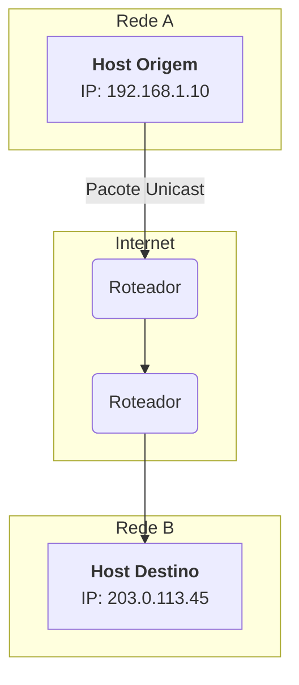
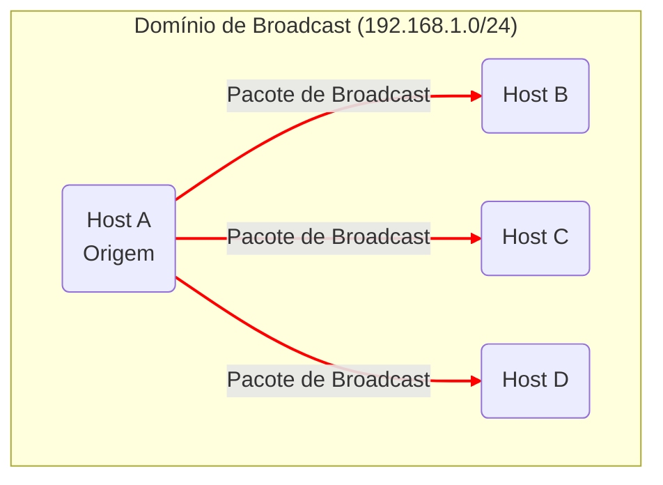
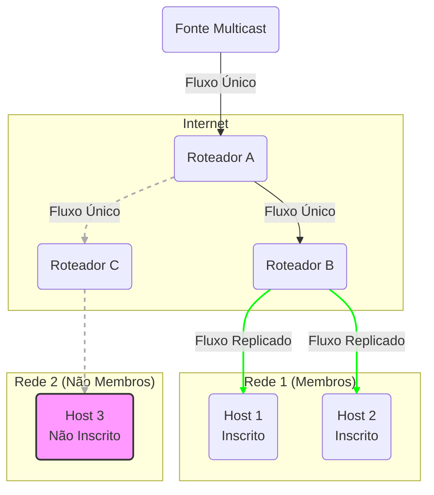

# Tipos de Entrega de Mensagens

Em redes de computadores, a transmissão de pacotes de uma origem para um ou mais destinos é categorizada em três modos fundamentais de entrega: Unicast, Broadcast e Multicast. Cada modo possui características técnicas, mecanismos de endereçamento e casos de uso distintos que determinam sua eficiência e aplicabilidade.

## Unicast

O modo Unicast representa a forma mais fundamental de comunicação em uma rede: uma transmissão de um ponto a outro.

### Detalhes Técnicos

Em uma transmissão Unicast, um único pacote é gerado por um host de origem e endereçado a um único host de destino. Cada host na rede possui um endereço único (como um endereço IP e um endereço MAC), e os pacotes Unicast contêm o endereço específico do host de destino em seu cabeçalho.

Os dispositivos intermediários, como switches e roteadores, utilizam esse endereço de destino para encaminhar o pacote através da rede pela rota mais eficiente até que ele alcance seu destino final. Esta é a base para a grande maioria do tráfego na Internet, incluindo navegação em sites (HTTP), envio de e-mails (SMTP) e transferência de arquivos (FTP).

### Diagrama de Comunicação Unicast

O diagrama abaixo ilustra um host de origem enviando um pacote para um único host de destino.

## Broadcast

O modo Broadcast é um mecanismo de comunicação de um para todos, onde um único pacote de origem é entregue a todos os hosts dentro de um mesmo domínio de rede.

### Detalhes Técnicos

Uma transmissão Broadcast utiliza um endereço especial de destino. Na Camada 2 (Enlace), o endereço MAC de destino é `FF:FF:FF:FF:FF:FF`. Na Camada 3 (Rede), para IPv4, utiliza-se um endereço de broadcast, que geralmente é o endereço mais alto de uma sub-rede (por exemplo, `192.168.1.255` em uma rede `192.168.1.0/24`).

Quando um switch recebe um quadro (frame) com o MAC de broadcast, ele o replica para todas as suas portas, exceto a porta de origem. Todos os hosts no domínio de broadcast recebem e processam o pacote, o que pode gerar uma carga de processamento significativa em todos os dispositivos da rede. Por essa razão, os roteadores, por padrão, não encaminham pacotes de broadcast, confinando-os à rede local (domínio de broadcast).

### Diagrama de Comunicação Broadcast

Este diagrama mostra um host enviando um pacote de broadcast que é recebido por todos os outros hosts na mesma rede local.

### Casos de Uso
*   **ARP (Address Resolution Protocol):** Um host envia uma requisição ARP em broadcast para descobrir o endereço MAC correspondente a um endereço IP na rede local.
*   **DHCP (Dynamic Host Configuration Protocol):** Um cliente que acabou de entrar na rede envia uma mensagem DHCPDISCOVER em broadcast para encontrar um servidor DHCP.

## Multicast

O modo Multicast é um modelo de comunicação de um para muitos, que combina a eficiência do broadcast com o direcionamento do unicast.

### Detalhes Técnicos

O Multicast permite que uma fonte envie um único pacote que é replicado e entregue apenas a um grupo específico de hosts "interessados" em recebê-lo. Isso otimiza drasticamente o uso da largura de banda em comparação com o envio de múltiplos pacotes unicast.

*   **Endereçamento Multicast:** Utiliza-se um bloco especial de endereços. Em IPv4, são os endereços de Classe D, no intervalo de `224.0.0.0` a `239.255.255.255`. Cada endereço nesse intervalo representa um "grupo multicast".

*   **Gerenciamento de Grupos (IGMP):** Os hosts que desejam receber o tráfego de um grupo multicast precisam se inscrever nele. Eles fazem isso usando o **IGMP (Internet Group Management Protocol)**. O host envia uma mensagem IGMP para seu roteador local, informando seu interesse. O roteador, por sua vez, passa a encaminhar o tráfego daquele grupo para a interface de rede onde o host está conectado. Quando um host não quer mais receber os pacotes, ele envia uma mensagem de "saída" (leave).

*   **Roteamento Multicast:** Roteadores utilizam protocolos de roteamento especiais, como o **PIM (Protocol-Independent Multicast)**, para construir árvores de distribuição que garantem que os pacotes multicast sejam encaminhados apenas pelas rotas que levam a membros do grupo.

### Diagrama de Comunicação Multicast

O diagrama ilustra uma fonte enviando um único fluxo de dados. Os roteadores replicam o fluxo apenas para as redes que contêm hosts inscritos no grupo multicast.

### Casos de Uso
*   **IPTV:** Transmissão de canais de televisão pela Internet para múltiplos assinantes.
*   **Streaming de Eventos ao Vivo:** Distribuição de vídeo e áudio para um grande público.
*   **Jogos Online Massivos:** Sincronização do estado do jogo entre múltiplos jogadores.
*   **Mercado Financeiro:** Distribuição de cotações de ações em tempo real para terminais de operadores.